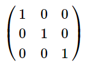
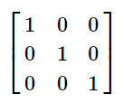

# LATEX

 本书并非指导你如何成为一个专业LaTeX 程序员，或者排版方面的专家，

 本书仅限于写学术类笔记，或者排版对格式没有严格要求的论文。

 本书目的在于让0基础的人能迅速熟练使用LaTeX ，并且直接复制书里的代码使用。

 本书不会有过多理论讲解，你直接用就对了，以实用方便为最终目标。 

# 基本知识

虽然LaTex功能强大,但是它本身非常笨重,学习起来也并不是非常轻松,要说记笔记首选的还是markdown,但是对于一些专业性的文章或者对样式要求严格的学术书籍,LaTex绝对是不二之选.

## 发展史

## 基本结构

在学习理论之前,我们首先来看看LaTex的基本结构

```latex
\documentclass{ctexart}
\title{标题}
\author{作者}
\date{日期}
\begin{document}
  \maketitle
  \tableofcontents
  hello world
\end{document}
```

虽然此时你并不能理解每一项的含义,不过你应该基本上能明白LaTex的语法了.

LaTex文章的内容从`\begin{document}`开始,在`\end{document}`结束,前面可以进行别的设定.详细的请看**文档**那一章节.


## 常用控制台命令

​		texdoc相关

-  调用符号大全

  ```shell
  texdoc symbols  
  ```

-   调出class和package编写指南

  ```shell
  texdoc  clsguide 
  ```


# 文档设置

## 文档类型

```latex
\documentclass{ctexart}
```

## 文档标题

这个是用来写你文章标题的,只有写了这个你才能编辑标题内容否则不显示.

```latex
\maketitle
```
下面这个就是标题的具体内容,很简单,一目了然
```latex
\title{标题}
\author{作者}
\date{日期}
```

## 文档摘要

因为摘要一般都是在标题下面的,所以请把代码放在`\maketitle`后面.

```latex
\begin{abstract}
该部分内容是放置摘要信息的。
\end{abstract}
```

## 目录

只要加了这句就有目录了,放在`\begin{document}`之前就行

```latex
\tableofcontents
```


# 文档内容

## 文档结构

latex分为多级标题,可以用代码简单设置,编译器会自动帮你排序,很方便.

```latex
\section{一级标题}
\subsection{二级标题} 
\subsubsection{二级标题}
```

这个标题默认居中,如果不想居中可以设置左对齐,同样的,记住有关设置的都要放在`\begin{document}`之前.

```latex
%section左对齐
\ctexset{
section = {
    format = \raggedright\Large\bfseries,
    }
}
```


# 文字

# 列表


## 无序列表

```latex
%需要添加宏包：
\usepackage{enumerate}

\begin{itemize}
	\item 无序列表内容
\end{itemize}
```

## 有序列表

```latex
%需要添加宏包：
\usepackage{enumerate}

\begin{enumerate}[i)]
	\item 12345.
\end{enumerate}
```

# 代码块

```latex
\begin{lstlisting}[language={tex}]
\end{lstlisting}
```

## 常见语言


# 图片

```latex
\begin{figure}[ht]
\centering
\includegraphics[scale=缩放因子]{图片的名字}
\caption{对图片的描述}
\label{fig:图片的引用名}
%注意图片要放在tex同目录下。
```

# 表格


# 数学公式

数学公式一般`$  $`来包起来,表示行内公式,而比较重要的大型公式则用`$$  $$`包起来.

```latex
%建议加入宏包
\usepackage{listings}
```


## 基础语法

### 加减乘除

```latex
$x_1 = 3 + 2 - 1$
$x_2 = t_1 \times t_2$
$x_2 = t_1 \cdot t_2$
$y = \frac{x_1}{x_2}$
$y = {x_1}/{x_2}$
$y = {x_1} \div {x_2}$
```
结果如下:
$x_1 = 3 + 2 - 1$
$x_2 = t_1 \times t_2$
$x_2 = t_1 \cdot t_2$
$y = \frac{x_1}{x_2}$
$y = {x_1}/{x_2}$
$y = {x_1} \div {x_2}$


### 上标和下标

```latex
$a^2$
```
$a^2$

```latex
$x_1$
```
$x_1$

```latex
$x^n_0$
```

$x^n_0$

### 向上取整,向下取整

```latex
$\lfloor x \rfloor$
```
$\lfloor x \rfloor$

```latex
$\lceil x \rceil$
```
$\lceil x \rceil$

### 根式

```latex
\sqrt{3}
\sqrt[n]{3}
```

$\sqrt{3}$      $\sqrt[n]{3}$

### 花体字母

```latex
%写花体字母要加下面的宏包
\usepackage{amsthm,amsmath,amssymb}
\usepackage{mathrsfs}
\usepackage{amssymb}

$\mathbb{R}$
$\mathcal{R}$
$\mathscr{R}$
```

$\mathbb{R}$  $\mathcal{R}$  $\mathscr{R}$

## 竖式

### 加法竖式

```latex
%需要添加宏包
\usepackage{dcolumn}

\begin{tabular}{cD{.}{.}{3}}
  &12.7\\
  +&143.87\\
  +&0.654\\
  +&24\\
  \hline
  =&181.224
\end{tabular}
```


### 除法竖式

可以自动计算小学竖式,还有各种竖式

```latex
%需要添加宏包
\usepackage{Polynom}

\polylongdiv{x^3+x^2-1}{x-1}
```


## 矩阵

### 圆形矩阵

```latex
\begin{pmatrix}
    1 & 0 & 0\\\\
    0 & 1 & 0\\\\
    0 & 0 & 1\\\\
\end{pmatrix}
```



### 方形矩阵

```latex
\begin{bmatrix}
    1 & 0 & 0\\\\
    0 & 1 & 0\\\\
    0 & 0 & 1\\\\
\end{bmatrix}
```




### 行列式

```latex
\begin{vmatrix}
    1 & 0 & 0\\\\
    0 & 1 & 0\\\\
    0 & 0 & 1\\\\
\end{vmatrix}
```


### 复杂矩阵

```latex
$$A = 
    \begin{pmatrix}
        a_{11} & a_{12} & \cdots & a_{1n}\\
        a_{21} & a_{22} & \cdots & a_{2n}\\
        \vdots & \vdots & \ddots & \vdots\\
        a_{n1} & a_{n2} & \cdots & a_{nn}\\
    \end{pmatrix}$$
```


## 数理逻辑

```latex
\bar{q} \to p
```

$\bar{q} \to p$

# 常用宏包

# latex转义字符表

## 格式符号

|  代码  |     解释     |
| :----: | :----------: |
| \qquad |     空格     |
|  \par  | 换行 |
|  \\\  |     换行     |
| \newline | 换行 |
| \newpage | 命令结束当前页,开始新的一页 |

## 希腊字母表

如果想要使用希腊字母请用数学符号块`$ $`来包起来,latex认为这些属于数学符号

| 代码     | 小写符号 | 代码   | 大写符号 |
| -------- | -------- | ------ | -------- |
| \alpha   | $\alpha$ | \Alpha | $\Alpha$ |
| \beta    | $\beta$  | \Beta | $\Beta$ |
| \gamma   | $\gamma$ | \Gamma | $\Gamma$ |
| \delta   | $\delta$ | \Delta | $\Delta$ |
| \epsilon | $\epsilon$ |\Epsilon | $\Epsilon$ |
| \zeta    | $\zeta$  | \Zeta | $\Zeta$ |
| \nu      | $\nu$    | \Nu | $\Nu$ |
| \xi      | $\xi$      | \Xi | $\Xi$ |
| \omicron | $\omicron$ | \Omicron | $\Omicron$ |
| \pi      | $\pi$    | \Pi | $\Pi$ |
| \rho     | $\rho$   |\Rho | $\Rho$ |
| \sigma   | $\sigma$ | \Sigma | $\Sigma$ |
| \eta     | $\eta$   | \Eta | $\Eta$ |
| \theta   | $\theta$ | \Theta | $\Theta$ |
| \iota    | $\iota$  | \Iota | $\Iota$ |
| \kappa   | $\kappa$ | \Kappa | $\Kappa$ |
| \lambda  | $\lambda$ |\Lambda | $\Lambda$ |
| \mu      | $\mu$    | \Mu | $\Mu$ |
| \tau     | $\tau$   | \Tau | $\Tau$ |
| \upsilon | $\upsilon$ |\Upsilon | $\Upsilon$ |
| \phi     | $\phi$   |\Phi     | $\Phi$ |
| \chi     | $\chi$   | \Chi | $\Chi$ |
| \psi     | $\psi$   | \Psi | $\Psi$ |
| \omega   | $\omega$ | \Omega  | $\Omega$ |

## 常用数学符号

| 代码        | 符号        | 含义     |
| ----------- | ----------- | -------- |
| \le 或 \leq | $\le$       | 小于等于 |
| \leqslant   | $\leqslant$ | 小于等于 |
| \ge 或 \geq | $\ge$       | 大于等于 |
| \geqslant   | $\geqslant$ | 大于等于 |


## 数理逻辑

| 代码          | 符号        | 含义 |
| ------------- | ----------- | ---- |
| \lnot 或 \neg | $\lnot$     | 非   |
|               |             |      |
| \wedge        | $\wedge$    | 析取 |
| \bigwedge     | $\bigwedge$ |      |
| \vee          | $\vee$      | 合取 |
| \bigvee       | $\bigvee$   |      |
| \to           | $\to$       | 蕴含 |
| \forall       | $\forall$   | 任意 |
| \exists       | $\exists$   | 存在 |
|               |             |      |
|               |             |      |
|               |             |      |
|               |             |      |


## 推理证明


| 代码               | 符号                 | 含义     |
| ------------------ | -------------------- | -------- |
| \because           | $\because$           | 因为     |
| \therefore         | $\therefore$         | 所以     |
| \rightleftharpoons | $\rightleftharpoons$ | 充要条件 |
| \Rightarrow        | $\Rightarrow$        | 单向推理 |
| \forall            | $\forall$            | 任意     |
| \exists            | $\exists$            | 存在     |
| \leftrightarrow    | $\leftrightarrow$    | 命题等值 |
| \Leftrightarrow    | $\Leftrightarrow$    | 公式等价 |
|                    |                      |          |


## 集合论

| 代码        | 符号          | 含义     |
| ----------- | ------------- | -------- |
| \subseteq   | $\subseteq$   | 包含     |
| \subsetneqq | $\subsetneqq$ | 真包含   |
| \in         | $\in$         | 属于     |
| \ni         | $\ni$         | 属于     |
| \notin      | $\notin$      | 不属于   |
|             |               |          |
| \cup        | $\cup$        | 并集     |
| \bigcup     | $\bigcup$     | 广义并集 |
| \cap        | $\cap$        | 交集     |
| \bigcap     | $\bigcap$     | 广义交集 |
| \oplus      | $\oplus$      | 对称差   |
|             |               |          |
| \varnothing | $\varnothing$ | 空集     |
|             |               |          |
|             |               |          |
|             |               |          |
|             |               |          |
|             |               |          |
|             |               |          |
|             |               |          |
|             |               |          |
|             |               |          |
|             |               |          |
|             |               |          |
|             |               |          |
|             |               |          |
|             |               |          |
|             |               |          |
|             |               |          |

## 微积分

| 代码        | 符号          | 含义         |
| ----------- | ------------- | ------------ |
| \sum​        | $\sum$        | 求和         |
| \prod       | $\prod$       | 连乘         |
| \lim        | $\lim$        | 极限         |
| \int        | $\int$        | 不定积分     |
| \iint       | $\iint$       | 二重不定积分 |
| \iiint      | $\iiint$      | 三重不定积分 |
| \oint       | $\oint$       | 曲线积分     |
| \mathrm{d}x | $\mathrm{d}x$ | 微分算子     |
| \mathrm{d}y | $\mathrm{d}y$ | 微分算子     |
| \infty      | $\infty$      | 无穷         |
| \triangle   | $\triangle$   |              |
| \nabla      | $\nabla$      | 全微分       |


# 2020/6/11

