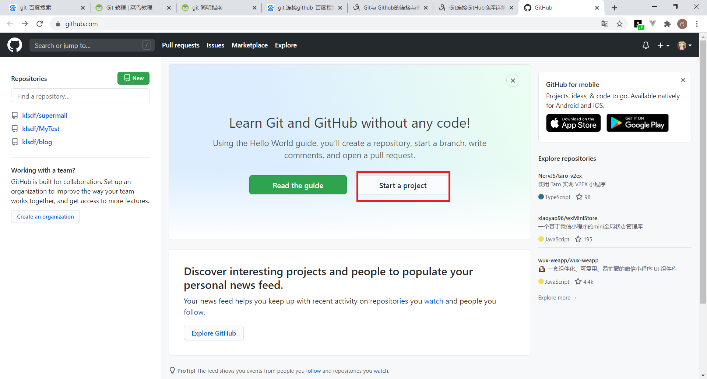
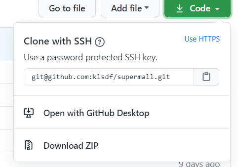

# GIT简介

# 连接GitHub流程

## 0. 配置

### 在GitHub建立项目



之后右上角可以找到你的项目


### 配置ssh


## 1.在本地创建仓库

```shell
git init
```

## 2.把工作内容添加入暂存区

```shell
git add *
```

## 3.把暂存区内容推入本地数据仓库

```shell
git commit -m "代码提交信息"
```

## 4.连接远程服务器

若之前这个本地仓库已经连接过这个服务器,可以跳过这条.

```shell
git remote add origin git@github.com:某某某/某项目名.git
```

注意!!!后面那串github的地址并不是固定的,需要根据你在github上面的项目决定.



## 5.把本地仓库的数据推入远程仓库

若你第一次提交这个项目,请用下面的代码

```shell
git push -u origin master
```

若不是第一次,可以用下面的代码

```shell
git push
```

# 分支

## 创建分支

```shell
git checkout -b 分支名
```

## 查看分支

查看所有分支

```shell
git branch -a
```

查看远程所有分支

```shell
git branch -r 
```

## 切换分支

```shell
git checkout 目标分支
```

## 合并分支

 将目标分支与当前分支进行合并

```shell
git merge origin/目标分支
```


# 其他操作

## 克隆远程仓库

```shell
git clone  "url"
```

## 查看工作区、暂存区的状态

```shell
git status
```

## 拉取远程库

```shell
git pull <别名> <分支名>
```

## 删除

从git中删除指定文件

```shell
git rm 文件名(包括路径) 
```


# 常见错误

```
! [rejected] master -> master (fetch first) error: failed to push some refs to ' 。。。'
```

出现这个问题是因为github中的README.md文件不在本地代码目录中，可以通过如下命令进行代码合并

```shell
git pull --rebase origin master
```

# 2020/8/26