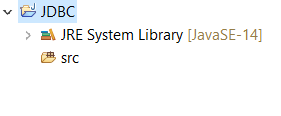

# 下载JDBC的jar包

要知道你这个jdbc之所以能用是人家MySql的MySQL AB公司给了你这个接口,你才能连接,没有这东西,啥都免谈.那好了,我现在问你,你觉得这个接口应该找谁去要?找java的sun公司吗?可不是所有人都有共产主义精神的,人家sun公司凭啥帮你呢?(虽然最后都被收购了,有点像大鱼吃小鱼?????????),所以你需谁哪家数据库的jar,就去哪家的官网找,你放心一般主流数据库厂商都有这个的,没有这个东西你java连不了,那就没人用你的JDBC,所以所有厂商都很积极.

我们以MySql为例,下载连接为https://dev.mysql.com/downloads/connector/j/,不过可能需要翻墙,如果下不下来,加我QQ,我给你资源.(1796655849)

一般来说jar包的名字都叫这种  mysql-connector-java-8.0.11 ,大家可以参考.

# 在eclipse中配置

我们以eclipse为例子进行配置,另外,我听说idea的配置很简单,不知道真的假的.

1. 建立一个新的工程,这样出错后可以删了重来,不然可能会导致你其他工程也出现问题,我建的叫JDBC



2. 在这个新的项目里面右键建一个文件夹,名字随意,我的叫JDBC_JAR


3. 把刚才下载的jar包拖到这个新建的文件夹里面去


4. 对着这个jar包右键,选择Build Path 里面的Add to Build Path,之后会自己生成一个文件夹.


5. 现在可以创建一个项目来测试一下了,在src里面右键建一个新的类,我的叫Test


6. 把下面的代码修改后粘过去

注意:

- 用'<>'框起来的就是让你替换的,比如说你的数据库叫students,那么就用students来把<你的数据库名字>整体都替换掉,不要留'<>'.
- 别忘了public类的类名必须和你文件名一致,记得改一下.

```java
import java.sql.*;

public class Test {
	public static void main(String[] args) {
		try {
			Class.forName("com.mysql.cj.jdbc.Driver");
			System.out.println("成功加载数据库!!!!");
		} catch (Exception e) {
			System.out.print("数据库加载失败!");
			e.printStackTrace();
		}
		try {
			Connection connect = DriverManager
					.getConnection("jdbc:mysql://localhost:3306/<你的数据库名字>?serverTimezone = GMT", "<你数据库的用户名>", "<数据库密码>");
			System.out.println("成功连接到了数据库!!");
			Statement stmt = connect.createStatement();
			ResultSet rs = stmt.executeQuery("select * from <表名>"); 
			while (rs.next()) {
				System.out.println(rs.getString("<列名>"));
			}
      connect.close();
			stmt.close();
		} catch (Exception e) {
			System.out.print("获取数据失败,请检查你查找的数据是否正确!!!");
			e.printStackTrace();
		}
	}
}
```

下面是我连接的代码,如果你数据库也看的我的教程的话,可以直接成功:

```java
import java.sql.*;

public class Test {
	public static void main(String[] args) {
		try {
			Class.forName("com.mysql.cj.jdbc.Driver");
			System.out.println("成功加载数据库!!!!");
		} catch (Exception e) {
			System.out.print("数据库加载失败!");
			e.printStackTrace();
		}
		try {
			Connection connect = DriverManager
					.getConnection("jdbc:mysql://localhost:3306/TwoDimensions?serverTimezone = GMT", "root", "4399");
			System.out.println("成功连接到了数据库!!");
			Statement stmt = connect.createStatement();
			ResultSet rs = stmt.executeQuery("select * from girls"); 
			while (rs.next()) {
				System.out.println(rs.getString("loli_name"));
			}
			connect.close();
			stmt.close();
		} catch (Exception e) {
			System.out.print("获取数据失败,请检查你查找的数据是否正确!!!");
			e.printStackTrace();
		}
	}
}
```

7. 执行,如果没有报错说明正常运行,这些代码具体啥意思,会在正篇讲解.