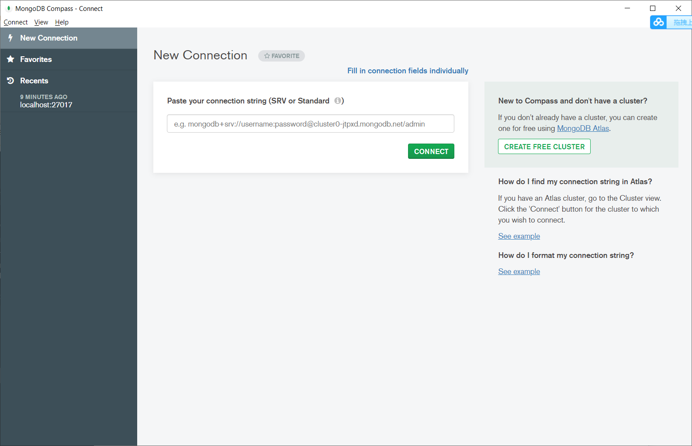
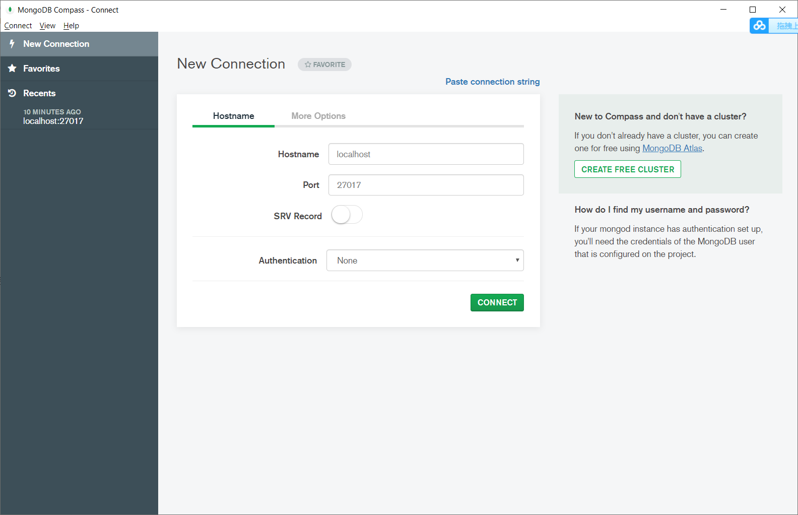

# 安装与配置

## 安装

一路next就行，如果想要改目录，就custom就行了，剩下的一直next。

## 配置

1. 找到刚才的安装路径
2. 找到bin目录，比如： D:\Program Development\MongoDB\bin
3. 把这个路径复制到用户的系统变量里面
4. 输入`mongod`来验证配置是否成功。

## 运行

1. 在c盘根目录创建一个data文件夹
2. 在data里面创建一个db文件夹
3. 在cmd中输入`mongod`启动服务器
4. 之后另开一个cmd，输入`mongo`来连接数据库
5. 然后输入js代码就可以运行了，比如1+1回车，输出2
6. 注意，不支持DOM BOM这些操作

# 概念

## 文档数据库

在传统的数据库中，信息被分割成离散的数据段，而在文档数据库中，文档是处理信息的基本单位。一文档可以很长、很复杂、可以无结构，与字处理文档类似。一个文档相当于关系数据库中的一条记录。

## 文档

文档数据库的基本单位，我们存取读写的文件都是文档。多个键值对的有序存放在一起就是文档。其实就是指关系数据库的一个元组。

## 集合

集合就是一组文档，相当于关系数据库的表，比如学生表，萝莉表什么的。

## 数据库

多个集合组成一个数据库，或者一个数据库包含多个实例

# 可视化界面

## 安装与配置

1. 首先找到MongoDB Compass并下载
2. 双击exe文件运行
3. 然后进入一个新的页面，让你建立连接，直接点右上角Fill in，，，



4. 配置主机名，端口号什么什么的




# 基本指令

## 显示所有数据库

```sql
show dbs
show databases
```

## 显示当前数据库名

```
db
```

## 使用数据库

```
use 数据库名
```

## 显示集合

```
show collections
```

# 插入指令

## 插入单个

```sql
db.集合名.insert(JSON对象)
比如：
db.lolis.insert({name:"26",age:12})
```

或者

```sql
db.lolis.insertOne({name:"26",age:12})
```

## 自定义_id

在插入数据时，自定义了id，系统就不会自动分配了。

强烈建议！不要自定义id！！！！

```sql
db.lolis.insert({_id:123,name:"26",age:12})
```


## 插入多个

直接放一个对象数组就可以了

```sql
db.lolis.insert([
   {name:"雷姆",age:12},
   {name:"拉姆",age:12}
])
```

或者

```sql
db.lolis.insertMany([
   {name:"雷姆",age:12},
   {name:"拉姆",age:12}
])
```


# 查询指令

## 全部查询

查询集合中所有文档

```SQL
db.集合名.find({})
```

## 字段查询

```sql
db.lolis.find({name:"雷姆"})
```

## 统计查询数量

```sql
db.lolis.find({}).count()
```

# 修改指令

update默认只修改一个数据。

## 全部替换

这个指令会把查询条件全部替换。

```sql
db.lolis.update(查询条件,修改的内容)
//比如
db.lolis.update({name:"雷姆"},{name:"雷姆",age:100})
```

## 修改指定属性

```sql
db.lolis.update({name:"雷姆"}, 
    {$set:
        {age:101}
    }
)
```

## 删除指定属性

```sql
db.lolis.update({name:"雷姆"}, 
    {$unset:
        {age:101}
    }
)
```

## 修改多个数据

```sql
db.lolis.update({name:"雷姆"}, 
    {$set: 
        {age:101}
    },
    {
        multi:true
    }
)
```

# 删除指令

## 删除一个或多个

```sql
db.lolis.remove(
  {查询条件}, 
  {justOne: true}
)
```

## 全部删除

```sql
db.lolis.remove({})
```

但是推荐下面这个，性能更好

```sql
db.lolis.drop()
```

## 删库+跑路

```sql
db.dropDatabase()
```

