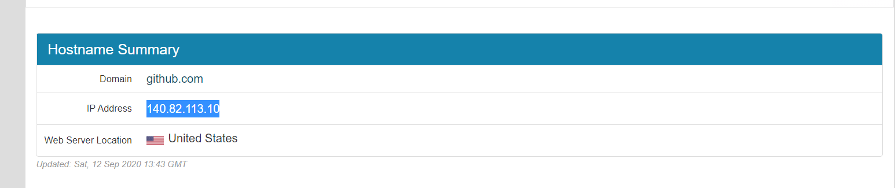
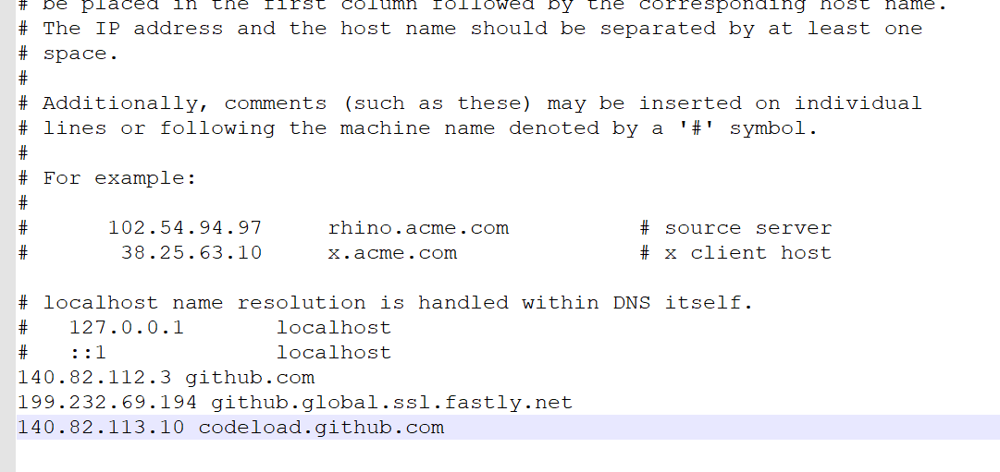

# steam买锁区游戏

1. 进入https://steamdb.info/ 搜索想买的游戏

2. 复制游戏的id

3. 打开<a href="https://store.steampowered.com/">steam网页版</a>并登录

4. win+R 之后在搜索框里面输入https://store.steampowered.com/widget/(游戏id)


# GitHub下载提速

1. 打开https://www.ipaddress.com/ ，但是需要翻墙

2. 依次搜索github.com    github.global.ssl.fastly.net      codeload.github.com

3. 依次复制这三个网站的IP地址
    

4. 打开 C:\Windows\System32\drivers\etc\hosts ，直接在C盘找到或者搜索都行。

5. 直接把ip地址和网站粘贴到hosts文件里面

   

6. 打开cmd，刷新DNS

```
ipconfig /flushdns
```

7. 虽然并不是很快，但是比之前快多了，要注意，这个ip是动态ip，有可能会变，如果发现下载又慢了，就再找一下最新ip然后修改hosts文件就行了。

# chrome插件安装

1. chrome右上角三个点
2. 点开拓展程序
3. 把crx文件拖入里面

## 推荐插件

| 名字            | 功能                   |
| --------------- | ---------------------- |
| Astar VPN       | 翻墙                   |
| Vue.js devtools | 查看调试网页VUE源代码  |
| GitHub加速      | 顾名思义，非常非常实用 |

# 连不上网怎么办

## 重置网关

1. cmd进入命令提示符
2. 输入`netsh winsock reset`重置网关.
3. 重启电脑

## 修改路由器配置

1. http://192.168.3.1/