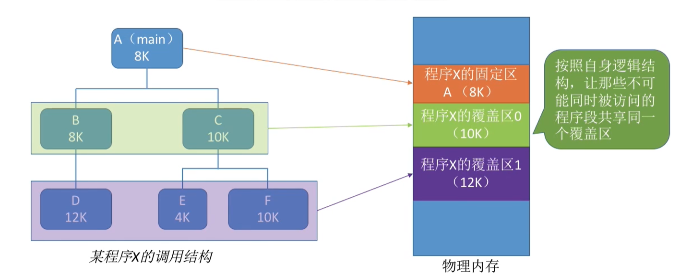
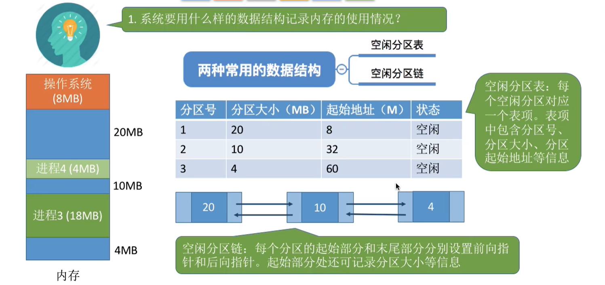

# 基础知识

## 操作系统的发展和分类

### 手工操作阶段

# 内存

## 基础

内存地址从0开始，每个地址对应一个**存储单元**。如果计算机**按字节编址**，那么一个存储单元就是一个Byte，如果**按字编址**，那么一个存储单元就是一个字。但是要注意，不同计算机的字长是不一样的，所以存储单元的大小可能不一样。

## 数量单位

$1K = 2^{10}$

$1M = 2^{20}$

$1G = 2^{30}$

这就是说，4GB的内存就相当于，存储单元有$4*2^{30}=2^{32}$个。若果是按字节编制的话，就有$2^{32}$Byte。当然，若果是按字编址的话，就有$2^{32}$个字。

## 逻辑地址和物理地址

逻辑地址就是在某个基地址上面加个某数，CE修改游戏经常会用到，也就是指针扫描出来的XXXX+0x某某某某。物理地址就是实际的地址，也就是scan出来的地址。

## 链接的三种方式

1. 静态链接

   在程序运行之前，先将各目标模块及它们所需的库函数连接成一个完整的可执行文件（装入模块），这个玩意就是一大坨整体，内存地址是连续的，之后不再拆开。

2. 装入时动态链接

   将各目标模块装入内存时，边装入边链接的链接方式。

3. 运行时动态链接

   在程序执行中需要该目标模块时，才对它进行链接。其优点是便于修改和更新，便于实现对目标模块的共享。

## 装入的三种方式

所谓的装入，**就是把逻辑地址转化成物理地址**。也就是说程序如何放入到内存中，放到哪里。

1. 绝对装入

   这个就是说在编译阶段就分配好了内存，到时候直接用就行。比如说逻辑地址是80，那么实际上分到的就是80.

2. 静态重定位

   这个是说在内存分配的时候，根据你程序起始地址所进行的重定位。

   比如说，你的逻辑地址是80，但你这个程序的起始地址是100，那么最后分到的地址就是180。

3. 动态重定位

   这个东西很强，装入程序把模块放入内存的时候，并不会立刻把逻辑地址转化为物理地址，而是等到需要使用的时候再去执行。这次CPU会分出来一个重定位寄存器，专门存放装入模块的起始地址，因为装入内存后所有的地址依然是逻辑地址。这种方式需要一个重定位寄存器的支持。

## 覆盖技术

程序一般都有一个模块的调用树，就跟vue那个模块调用一样。这就确保了一些模块只能被上级调用，没有互相调用。这样的话，我们就可以把那些彼此没有互相调用的程序覆盖。

## 对换技术

就是说把一些常用的放到内存，不常用的放到外存。所以外存也会有一个地方来存储这些数据。

外存分为**文件区**和**对换区**，文件区是随机存储的，存储效率高，但是读写效率低。对换区是顺序存储的，读写比较快，但是存储的效率低。

要注意PCB还是需要放在内存的。

## 内存分配

### 单一连续分配：

在单一连续分配方式中，内存被分为系统区和用户区。系统区通常位于内存的低地址部分，用于存放操作系统相关数据;用户区用于存放用户进程相关数据。

内存中只能有一道用户程序，这一个用户程序独占整个用户区空间。这就导致了我4G内存，你只用了100MB，会浪费大量的内存空间。

优点:实现简单;无外部碎片;可以采用覆盖技术扩充内存;不一定需要采取内存保护（eg:早期的PC操作系统MS-DOS) 。

缺点:只能用于单用户、单任务的操作系统中;有内部碎片;存储器利用率极低。

### 固定分区分配

20世纪60年代出现了支持多道程序的系统，为了能在内存中装入多道程序，且这些程序之间又不会相互干扰，于是将整个用户空间划分为若干个固定大小的分区，在每个分区中只装入一道作业，这样就形成了最早的、最简单的一种可运行多道程序的内存管理方式。

分区分为大小相等的和大小不等的

分区大小相等:缺乏灵活性，但是很适合用于用一台计算机控制多个相同对象的场合（比如:钢铁厂有n个相同的炼钢炉，就可把内存分为n个大小相等的区域存放n个炼钢炉控制程序)

分区大小不等:增加了灵活性，可以满足不同大小的进程需求。根据常在系统中运行的作业大小情况进行划分(比如:划分多个小分区、适量中等分区、少量大分区)

但是这两种都会造成内存资源的浪费，比如说我现在这个程序需要20MB的内存，但是你划分的都是30MB的，那么我就会浪费10MB的内存。

操作系统需要建立一个数据结构――**分区说明表**，来实现各个分区的分配与回收。每个表项对应一个分区，通常按分区大小排列。每个表项包括对应分区的大小、起始地址、状态（是否已分配）。

### 动态分区分配

这个是为了解决内存浪费而产生的，**动态分区分配**又称为**可变分区分配**。这种分配方式不会预先划分内存分区，而是在进程装入内存时，根据进程的大小动态地建立分区，并使分区的大小正好适合进程的需要。因此系统分区的大小和数目是可变的。(eg:假设某计算机内存大小为64MB，系统区8MB，用户区共56 MB.…）

