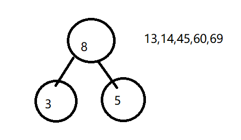
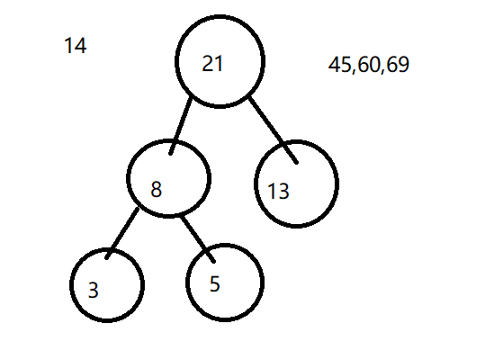

# 基本概念

## 线性结构与非线性结构

线性结构指的是逻辑上有线性关系的结构，即一个元素有唯一一个前驱和后继元素。又根据储存的方式分为顺序储存和链式储存两种线性结构。

非线性结构指的是逻辑上一个元素有多个前驱或者后继元素。

# 稀疏数组

## 原理

当一个数组中大部分元素为0，或者为同一个值的数组时，可以使用稀疏数组来保存该数组。

稀疏数组的处理方法是:

1. 记录数组一共有具行几列，有多少个不同的值
2. 把具有不同值的元素的行列及值记录在一个小规模的数组中，从而缩小程序的规模

比如说对于这样一个数组：

```java
int[][] arr = { 
  { 0, 0, 0, 0, 0 },
  { 0, 2, 0, 0, 0 }, 
  { 0, 0, 0, 0, 0 }, 
  { 0, 5, 0, 0, 0 }, 
  { 0, 0, 0, 0, 0 } };

```

明显全是0，真正需要储蓄的数据只有2个。但是你又不能真的把别的数据丢了，我们就可以借鉴人类的思维，只储存那些特例。比如说原来数组中2在第二行第二列，那么就可以创建一个新的数组，将2，2，2这个数据存放入。表示原数组第二行第二列存放的是2。恢复的时候只需要先new一个全0数组，之后填入数据即可。

先用伪代码看看思路：

```pseudocode
class 稀疏数组类{
	public static int[][] 压缩(需要压缩的原数组){
		int num;
		foreach(原数组){
			num = 获取原数组有几个非零数据;
		}
		/*3列分别代表原数据行，列和内容*/
		/*第一行用来储存原数组的长宽和非零数据个数，所以num+1*/
		int[][] 稀疏数组 = new int[num+1][3列] 
		再次for(原数组){
			稀疏数组=非零数据;
		}
		return 稀疏数组;
	}
	
	public static int[][] 解压(需要解压的原数组){
		int[][] 解压后的数组 = new int[储存的行][储存的列];
		for(){
			解压后的数组=需要解压的原数组;
		}
		return 解压后的数组;
	}
	
}
```


## 简单实现

```java
public class SparseArray {
	public static int[][] compress(int[][] arr) {
		int row = arr.length;
		int column = arr[0].length;
		int num = 0;
		//获取非零数目
		for (int[] tempRow : arr)
			for (int item : tempRow)
				if (item != 0)
					num++;

		int[][] compressArr = new int[num + 1][3];
		compressArr[0][0] = row;
		compressArr[0][1] = column;
		compressArr[0][2] = num;
		int tempRow = 1;
		//储存原数组非零元素
		for (int i = 0; i < row; i++)
			for (int j = 0; j < column; j++)
				if (arr[i][j] != 0) {
					compressArr[tempRow][0] = i;
					compressArr[tempRow][1] = j;
					compressArr[tempRow][2] = arr[i][j];
					tempRow++;
				}
		return compressArr;
	}

	public static int[][] decompression(int[][] arr) {
		int[][] decomArr = new int[arr[0][0]][arr[0][1]];
		for (int i = 1; i <= arr[0][2]; i++) {
			decomArr[arr[i][0]][arr[i][1]] = arr[i][2];
		}
		return decomArr;
	}

	static void show(int[][] arr) {

		for (int[] tempRow : arr) {
			for (int item : tempRow) {
				System.out.print(item + "\t");
			}
			System.out.println("");
		}
	}

	public static void main(String[] args) {
		int[][] arr = { { 0, 0, 0, 0, 0 }, { 0, 2, 0, 0, 0 }, { 0, 0, 0, 0, 0 }, { 0, 5, 0, 0, 0 }, { 0, 0, 0, 0, 0 } };
		int[][] arr2 = compress(arr);
		int[][] arr3 = decompression(arr2);
		show(arr);
		System.out.println("");
		show(arr2);
		System.out.println("");
		show(arr3);
	}
}
```

# 队列

## 原理

先进先出。为了实现这种结构，我们需要两个指针，一个是front指针，**指向头部数据的第一个数据**，控制头部；一个是rear指针，**指向队尾最后一个数据的后一位**，控制尾部。

## 简单实现

难点在于数组循环的时候，究竟如何判断队列满和队列空。

我们先看看队列满的情况：

如果不用考虑循环，rear==data.length()时就可以了，但是考虑循环的话就不可能这么简单了。首先先分析满数据时有什么样的特点，因为队尾指针添加数据，碰到数组末尾从头回来继续添加，直到**从后面追上front**。此时front代表第一个数据，而rear代表最后一个数据的后一位，这两个如果相等就说明最后一个数据的下一位就是第一个数据了，说明队满。

之后是队空的情况：

跟刚才的原理差不多，front指针一直删除自己所在的下标的元素，**直到从后面追上rear**。在删除最后一个元素前，front指向该元素，而rear指向下一位。删除后，front++，此时front==rear。说明队空。

这时候就有问题了，判空和判满的条件是一样的，都是front==rear，那该怎么办呢？其实这两个虽然条件一样，但是空队列只可能是front在删除中遇到rear。而队满也是rear添加时遇到front。所以只要再用一个bool来判断是谁追谁就可以完成这个算法了。

```java

class Queue {
	private int front;
	private int rear;
	private int[] data;
  //判断是front在后还是rear在后，默认rear在后的情况为true。
	boolean order=true;

	public Queue() {
		// 默认构造函数，可以拓展别的
		data = new int[5];
		front = rear = 0;
	}

	public boolean isEmpty() {
		return front == rear && order;
	}

	public boolean isfull() {
		return front == rear && !order;
	}

	public int add(int d) {
		if (isfull()) {
			System.out.println("添加失败");
			return -1;
		} else {
			data[rear] = d;
      //如果此时rear重新回到了开头，那么需要修改order。
			if (rear+1>=data.length)
				order=!order;
			rear = (rear + 1) % data.length;
			return d;
		}
	}

	public int remove() {
		if (isEmpty()) {
			System.out.println("不能删了！");
			return -1;
		}
		else {
			int temp = data[front];
      //同理，front循环之后，也需要反转order
			if (front+1>=data.length)
				order=!order;
			front = (front + 1) % data.length;
			return temp;
		}
	}

  //这个打印是打印整个队列，不是打印现有数据
	public void show() {
		for (int item = 0; item < data.length; item++) {
			System.out.print(data[item] + "\t");
		}
		System.out.println("\n");
	}
}

```

你会发现我写的和网上或者网课都不一样，我觉得他们的算法写出来有问题，如果你也搜过资料，你就会发现他们的判断队空和队满都是这么写的。

```java
public boolean isEmpty(){
	return front==rear;
}
public boolean isFull(){
	return (rear+1) % array.length == front;
}
```

也不是说这么写会错，你这样用rear+1的方式虽然可以避免和isEmpty()逻辑冲突，但是这样会导致一个数据的丢失，就是arr[rear]这个元素，永远无法被使用。因为rear指向的是非数据的内容，所以会造成一个数据的浪费，而我这个就不会有问题。小小地骄傲一下。

# 链表

## 单链表

链表的结构本身不难，但是重要的方法比较多，尤其是增删改查方面。单链表用一个头结点完成操作。

```java
class ListNode {
	public int data;
	public ListNode next = null;

	public ListNode() {
	}

	public ListNode(int data) {
		this.data = data;
	}
}

class LinkedList {
	private ListNode head;

	public LinkedList() {
		head = new ListNode();
	}

	public boolean isEmpty() {
		return head.next == null;
	}

	//长度
	public int length() {
		int count = 0;
		ListNode headCopy = head;
		while (headCopy.next != null) {
			count++;
			headCopy = headCopy.next;
		}

		return count;
	}

	// 默认插入到尾部
	public boolean insert(int data) {
		ListNode headCopy = head;
		while (headCopy.next != null)
			headCopy = headCopy.next;
		ListNode newNode = new ListNode(data);
		headCopy.next = newNode;
		return true;
	}

	// 在指定index之后插入
	public boolean insert(int data, int index) {
		if (index < 1) {
			return false;
		}
		return true;
	}

	//打印链表
	public void show() {
		ListNode firstNode = head.next;
		while (firstNode != null) {
			System.out.println(firstNode.data);
			firstNode = firstNode.next;
		}
	}
}

```

## 双向链表

单链表只能从前往后查找，在后面添加数据的时候效率很低。所以可以修改一个单链表的结构，增加一个pre指针，指向前一个结点，以达到反向搜索的功能。

大体原理都一样，但是为了体现改进，我把length改成了属性，实际上java原生的数据结构也是这样做的。

这个和上面那个单链表真的都差不多，没啥难度。

```java
class DoubleListNode {
	int data;
	public DoubleListNode next = null;
	public DoubleListNode pre = null;

	DoubleListNode() {}

	DoubleListNode(int data) {
		this.data = data;
	}
}

class DoubleLinkedList {
	static int length=0;
	private final DoubleListNode head;

	public DoubleLinkedList() {
		head = new DoubleListNode();
	}
	//默认插入
	public boolean insert(int data) {
		DoubleListNode headCopy = head;
		while (headCopy.next != null)
			headCopy = headCopy.next;
		DoubleListNode newNode = new DoubleListNode(data);
		headCopy.next = newNode;
		newNode.pre=headCopy;
		length++;
		return true;
	}
	//删除指定位置元素
	public boolean remove(int num) {
		if(num>length||num<1)
			return false;
		
		DoubleListNode oprNode = head;
		while (num!=0) {
			num--;
			oprNode=oprNode.next;
		}
		oprNode.pre.next=oprNode.next;
		oprNode.next.pre=oprNode.pre;
		
		length--;
		return true;
	}
	//打印链表
	public void show() {
		DoubleListNode firstNode = head.next;
		while (firstNode != null) {
			System.out.println(firstNode.data);
			firstNode = firstNode.next;
		}
	}
}
```

## 环形链表

```java
class CircleList {
	private final ListNode head;
	static int length;

	public CircleList() {
		head = new ListNode();
		length = 0;
	}

	public boolean insert(int data) {
		if (head.next == null) {
			ListNode newNode = new ListNode(data);
			head.next = newNode;
			newNode.next = head.next;
			length++;
			return true;
		}
		ListNode operaNode = head.next;
		while (operaNode.next != head.next) {
			operaNode = operaNode.next;
		}
		ListNode newNode = new ListNode(data);
		operaNode.next = newNode;
		newNode.next = head.next;
		length++;
		return true;
	}

	public void show() {
		if (length == 0) {
			System.out.println("空链表无法打印！");
			return;
		}
		ListNode operaNode = head.next;
		for (int i = 0; i < length; i++) {
			System.out.println(operaNode.data);
			operaNode = operaNode.next;
		}
		System.out.println("------------------");
	}
}
```

# 栈

用top表示栈顶元素。先进后出。

```java
class Stack{
	private int[] data;
	private int top;
	//默认构造函数
	public Stack() {
		data=new int[10];
		top=-1;
	}
	public Stack(int capacity) {
		data=new int[capacity];
		top=0;
	}
	public boolean isFull() {
		return top==data.length-1;
	}
	public boolean isEmpty() {
		return top==-1;
	}
	
	public Boolean push(int data) {
		if (isFull()) 
			return false;
		this.data[++top]=data;
		return true;
	}
	public Boolean pop() {
		if (isEmpty()) 
			return false;
		top--;
		return true;
	}
	public void show() {
		for (int i = 0; i <= top; i++) {
			System.out.print(data[i]+" ");
		}
	}
}
```

# 二叉树

## 链式存储

- 前序遍历:先输出父节点，再遍历左子树和右子树
- 中序遍历:先遍历左子树，再输出父节点，再遍历右子树
- 后序遍历:先遍历左子树，再遍历右子树，最后输出父节点

```java
class TreeNode {
	int data;
	public TreeNode left;
	public TreeNode right;

	public TreeNode(int data) {
		this.data = data;
		right = left = null;
	}

	public void insertLeft(int data) {
		this.left = new TreeNode(data);
	}

	public void insertRight(int data) {
		this.right = new TreeNode(data);
	}
}

class BinaryTree {
	// 根节点是储存数据的所以允许访问，和之前的不一样。
	public TreeNode root;

	public BinaryTree(TreeNode node) {
		root = node;
	}

	// 先序遍历
	public void PreTraver(TreeNode tempNode) {
		if (tempNode == null)
			return;
		System.out.println(tempNode.data);
		PreTraver(tempNode.left);
		PreTraver(tempNode.right);
	}

	public void PreTraver() {
		PreTraver(root);
	}

	// 先序查找
	public TreeNode PreFind(TreeNode tempNode, int data) {
		if (tempNode.data == data)
			return tempNode;
		if (tempNode.left != null) {
			tempNode = PreFind(tempNode.left, data);
		}
		if (tempNode.right != null) {
			tempNode = PreFind(tempNode.right, data);
		}
		return tempNode;
	}

	public TreeNode PreFind(int data) {
		return PreFind(root, data);
	}
}

public class TreeTest {

	public static void main(String[] args) {
		TreeNode node0 = new TreeNode(0);
		TreeNode node1 = new TreeNode(1);
		TreeNode node2 = new TreeNode(2);
		TreeNode node3 = new TreeNode(3);
		TreeNode node4 = new TreeNode(4);
		TreeNode node5 = new TreeNode(5);
		TreeNode node6 = new TreeNode(6);
		TreeNode node7 = new TreeNode(7);

		node0.left = node1;
		node1.right = node2;
		node1.left = node3;
		node0.right = node4;
		node4.left = node5;
		node2.left = node7;

		BinaryTree tree = new BinaryTree(node0);
		tree.PreTraver();
		tree.PreFind(3).left = node6;
		System.out.println("-----------------------");
		tree.PreTraver();
	}
}
```

​    

## 顺序存储

所谓顺序存储就是用数组来储存二叉树。

- 第n个元素的左子节点为2n+1
- 第n个元素的右子节点为2n+2
- 第n个元素的交节点为(n-1)/2

```java
class BinaryTree {
	// 根节点是储存数据的所以允许访问，和之前的不一样。
	private int[] data;
	public int length;

	// 自己提供数据初始化
	public BinaryTree(int[] data) {
		this.data = data;
		length = 0;
	}

	// 初始化，默认-1为非法值
	public BinaryTree(int data) {
		this.data=new int[16];
		for (int i = 0; i < this.data.length; i++) {
			this.data[i]=-1;
		}
		this.data[0]=data;
	}

	private void capacityExtends() {

	}

	public int getPosition(int data) {
		for (int i = 0; i < this.data.length; i++) {
			if (this.data[i] == data)
				return i;
		}
		return -1;
	}

	//默认在最后一个元素后面插入子节点
	public void insertLeft(int insert_data) {
		this.data[2 * length + 1] = insert_data;
	}

	//在指定位置插入左子节点
	public void insertLeft(int src_data, int insert_data) {
		int position = getPosition(src_data);
		this.data[2 * position + 1] = insert_data;
	}

	public void insertRight(int src_data, int insert_data) {
		int position = getPosition(src_data);
		this.data[2 * position + 2] = insert_data;
	}

	// 先序遍历
	public void PreTraver(int n) {
		if (n >= data.length||data[n]==-1)
			return;
		System.out.println(data[n]);
		PreTraver(2 * n + 1);
		PreTraver(2 * n + 2);
	}

	public void PreTraver() {
		PreTraver(0);
	}
}
```

## 线索二叉树

线索二叉树就是把单链表的普通二叉树变成双链表的。对于n个结点的二叉树，在二叉链存储结构中有n+1个空链域，如果让这些空余的指针也指向一些元素的话，就变成了线索二叉树。这种指针称为线索。

- 如果node.left为空，则存放指向遍历时该结点的前驱结点。

- 如果node.right为空，则存放指向遍历时该结点的后继结点。

其实线索二叉树的结构和树完全一样，只是在遍历时需要加入一些新的指针罢了，所以大体上可以直接继承树。

但是我没有继承，因为以后要用的话，直接粘过去就能运行，比较方便。

```java
enum Statue {
	// 分别表示子节点与线索
	Child, Thread
}

class TreeNode {
	int data;
	public TreeNode left = null;
	public TreeNode right = null;
	public Statue leftSta = Statue.Child;
	public Statue rightSta = Statue.Child;

	public TreeNode(int data) {
		this.data = data;
	}

	public void insertLeft(int data) {
		this.left = new TreeNode(data);
	}

	public void insertRight(int data) {
		this.right = new TreeNode(data);
	}
}

class BinaryTree {
	// 根节点是储存数据的所以允许访问，和之前的不一样。
	public TreeNode root;
	private TreeNode preNode;

	public BinaryTree(TreeNode node) {
		root = node;
		preNode = null;
	}

	// 先序遍历建立线索二叉树
	void Threaded(TreeNode node) {
		if (node == null)
			return;
		if (node.left == null) {
			node.left = preNode;
			node.leftSta = Statue.Thread;
		}
		// 注意！处理后继的时候是连接上一个后继，而不是处理当前
		// 因为在本次操作时，不知道下一次遍历的是哪一个结点。
		if (preNode != null && preNode.right == null) {
			preNode.right = node;
			node.rightSta = Statue.Thread;
		}

		preNode = node;
		if (node.leftSta == Statue.Child)
			Threaded(node.left);
		if (node.rightSta == Statue.Child)
			Threaded(node.right);
	}

	void Threaded() {
		Threaded(root);
	}

	// 先序遍历
	public void PreTraver(TreeNode tempNode) {
    //首先找到最左边那个指针，因为刚才已经把所有的后继元素都绑定过了，只需要一次迭代就能遍历了。
    //所以直接用tempNode.right就可以找到后继元素，不需要递归了。
    //因为最后一个元素没有后继，所以也没有人去preNode.right = node所以最后一个右子节点为null
    //可以用来判断终止条件。
		while (tempNode != null) {
			while (tempNode.leftSta!=Statue.Thread) {
				System.out.println(tempNode.data);
				tempNode=tempNode.left;
			}
			while (tempNode!=null) {
				System.out.println(tempNode.data);
				tempNode=tempNode.right;
			}
		}
	}

	public void PreTraver() {
		PreTraver(root);
	}

	public void showNode(TreeNode node) {
		System.out.println(node.data + "结点：左子节点为" + node.left.data + "，右子节点为" + node.right.data);
	}

}

```

先序遍历的结果只有一个null，可以作为终止条件。

# 堆

堆是基于二叉树的一种结构，是一种带排序的树。

-  若**堆的父节点值大于等于子节点值**，那么我们称它**大根堆**，也就是保证根节点最大。
- 若**堆的父节点值小于等于子节点值**，那么我们称它**小根堆**，也就是保证根节点最小。

```java

class Heap {
	private int[] data;
	int length, lastLeaf, lastBranch;

	// 自己提供数据初始化
	public Heap(int[] data) {
		this.data = data;
		// 数组长度
		length = data.length;
		// 最后一个叶子节点
		lastLeaf = length - 1;
		// 最后一个分支结点
		lastBranch = (lastLeaf - 1) / 2;
		adjustHeap(0);
	}

	public void heapSort() {
		// 从最后一个分支结点开始，首先把这个数组调整成一个大顶堆。
		for (int i = lastBranch; i >= 0; i--) {
			adjustHeap(i);
		}

		// 此时大顶堆已经初始化完毕
		// 只需要用根节点放和数组末尾(最后一个叶子节点)交换即可
		// 之后因为顺序乱了，需要重新调整
		for (int i = lastLeaf; i >= 0; i--) {
			swap(i, 0);
			adjustHeap(0, i);
		}
	}

  //从指定根节点一直调整到最后
	private void adjustHeap(int parent) {
		int leftChild = 2 * parent + 1;
		int pValue = data[parent];

		while (leftChild < length) {
			int maxChild = leftChild;
			int rightChild = leftChild + 1;
			if (rightChild < length && data[rightChild] > data[leftChild]) {
				maxChild = rightChild;
			}
			if (pValue >= data[maxChild]) {
				break;
			}
			data[parent] = data[maxChild];
			parent = maxChild;
			leftChild = 2 * maxChild + 1;
		}
		data[parent] = pValue;
	}

  //从指定根节点调整到指定位置，左闭右开区间
	private void adjustHeap(int parent, int length) {
		int leftChild = 2 * parent + 1;
		int pValue = data[parent];

		while (leftChild < length) {
			int maxChild = leftChild;
			int rightChild = leftChild + 1;
			if (rightChild < length && data[rightChild] > data[leftChild]) {
				maxChild = rightChild;
			}
			if (pValue >= data[maxChild]) {
				break;
			}
			data[parent] = data[maxChild];
			parent = maxChild;
			leftChild = 2 * maxChild + 1;
		}
		data[parent] = pValue;
	}

	private void swap(int a, int b) {
		int temp = data[a];
		data[a] = data[b];
		data[b] = temp;
	}

	public void show() {
		for (int i = 0; i < length; i++) {
			System.out.println(data[i]);
		}
	}

}

public class HeapTest {

	public static void main(String[] args) {
		int[] a = { 1, 9, 8, 7, 6, 5, 4, 6, 7 };
		int[] b = { 1, 2, 3, 4 };
		int[] c = { 9, 8, 7, 6, 5, 4, 3, 2, 1, 0 };
		Heap heap = new Heap(c);
		heap.heapSort();
		heap.show();
	}

}

```

# 哈夫曼树

构造一棵二叉树，若该树的带权路径长度达到最小，称这样的二叉树为最优二叉树，也称为哈夫曼树(Huffman Tree)。所谓的的带权路径长度就是所有结点的权重分别乘以到根节点的距离。

哈夫曼树一般用于数据压缩，存放一串字符所需的最少的二进制编码。这样就把频率最高的字符排在最前面保证长度最短，把频率最后的字符排在后面，让编码变长。这样就可以压缩数据了。压缩算法请看算法一文。数据结构主要讲结构而不是算法。

以这个数组为例：[3,5,13,14,45,60,69]

构建的算法：

1. 先排序
2. 首先把最小的两个值构成二叉树，根节点为5+3=8，较小的为左子节点
3. 把3,5移除数组，把8加入并排序。此时为[8,13,14,45,60,69] 



3. 然后再次用最小的两个数 8 13 来构成二叉树，并把8+13的值插入到数组中并排序。此时为[14,21,45,60,69]



4. 以此类推，直至数组只剩一个数

```java
//实现Comparable接口以便排序
class Node implements Comparable<Node> {
	int value;// 当前结点值
	int left;// 左子节点值
	int right;// 右子节点值

	public Node(int v) {
		value = v;
	}

	public int compareTo(Node n) {
		return this.value - n.value;
	}
}

class HuffmanTree {
	List<Node> nodes;
	public Node root;
	public HuffmanTree(int[] data) {
		nodes = new ArrayList<Node>();
		for (int d : data) {
			nodes.add(new Node(d));
		}

		while (nodes.size() != 1) {
			// 1.先排序
			Collections.sort(nodes);
			// 2.取出最小的两个数构成二叉树
			Node leftNode = nodes.get(0);
			Node rightNode = nodes.get(1);
			Node parNode= new Node(leftNode.value+rightNode.value);
			//3.删除之前的结点，加入新结点
			nodes.remove(leftNode);
			nodes.remove(rightNode);
			//4.加入新的父结点
			nodes.add(parNode);
		}
		root=nodes.get(0);
	}

	public void show() {
		for (Node node : nodes) {
			System.out.println(node.value);
		}
	}
}
```

# 二叉排序树

BST:(Binary Sort(Search)Tree),对于二叉排序树的任何一个非叶子节点，要求左子节点的值比当前节点的值小，右子节点的值比当前节点的值大。

特别说明:如果有相同的值，可以将该节点放在左子节点或右子节点

```java

class Node {
	int value;
	Node left;
	Node right;

	public Node(int value) {
		this.value = value;
	}
	public String toString() {
		return "值为"+value+" ";
	}
	
	public void add(Node node){
		if (node==null) {
			return;
		}
		if(node.value>this.value) {
			if (this.right==null) {
				this.right=node;
			}else {
				this.right.add(node);
			}
		}
		if(node.value<this.value) {
			if (this.left==null) {
				this.left=node;
			}else {
				this.left.add(node);
			}
		}
	}
	//中序遍历,因为这样子排序好的数，用中序遍历刚好就是顺序的
	public void InorderTraver() {
		if(this.left!=null)
			this.left.InorderTraver();
		System.out.println(this);
		if(this.right!=null)
			this.right.InorderTraver();
	}
}

class BinarySortTree {
	Node root;

	public BinarySortTree() {
		root = null;
	}

	public BinarySortTree(Node[] nodes) {
		this();
		for (int i = 0; i < nodes.length; i++) {
			root.add(nodes[i]);
		}
	}
	public BinarySortTree(int[] nodes) {
		this();
		for (int i = 0; i < nodes.length; i++) {
			add(new Node(nodes[i]));
		}
	}
	
	public void add(Node node) {
		if(root==null){
			root=node;
		}else {
			root.add(node);
		}
	}
	//默认中序遍历
	public void show() {
		if(root!=null)
			root.InorderTraver();
		else {
			System.out.println("为空！");
		}
	}

}

public class BSTTest {

	public static void main(String[] args) {
		int[] arr = {7,3,10,12,5,1,9};
		BinarySortTree tree = new BinarySortTree(arr);
		tree.show();
	}

}
```

