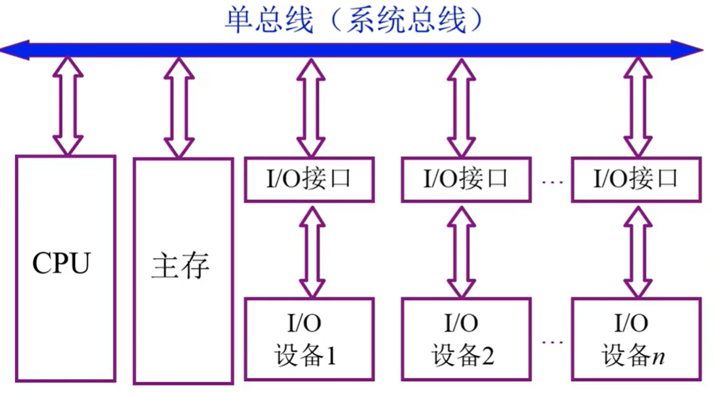
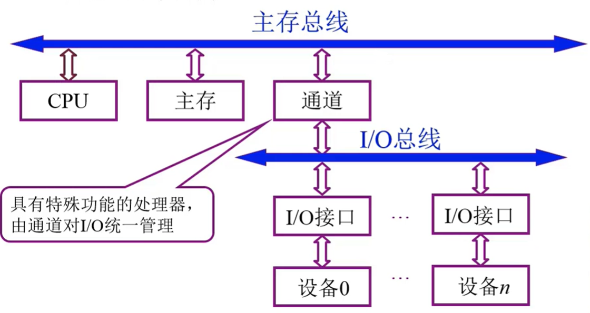
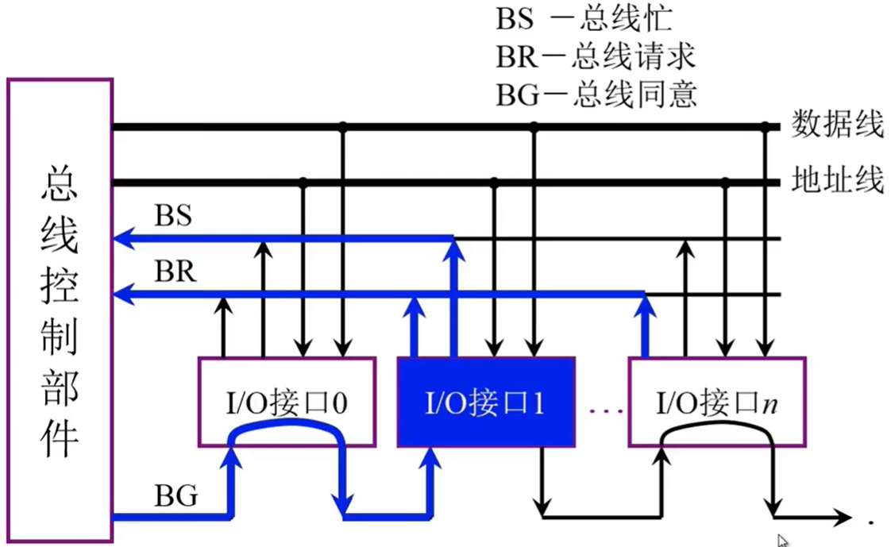
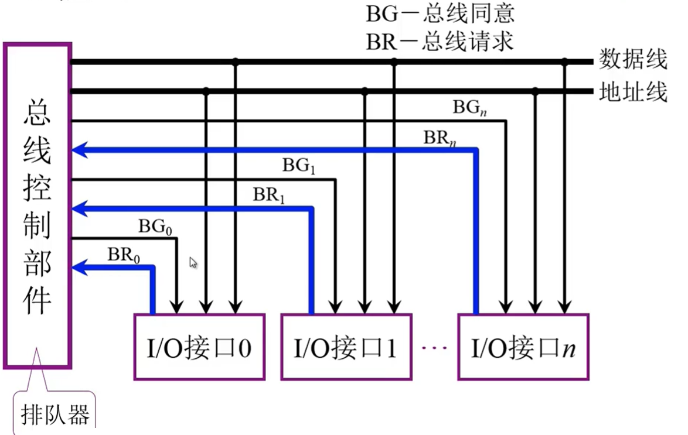
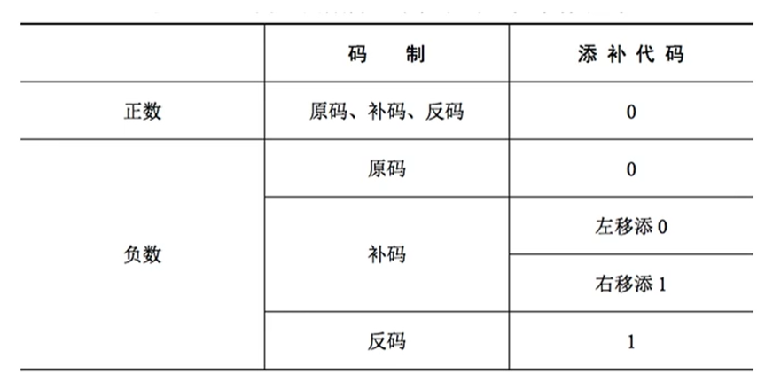

# 基础知识

## 冯诺依曼体系结构

1. 计算机硬件由运算器、控制器、存储器、输入设备和输出设备五大部分组成
2. 计算机处理的数据和指令一律用二进制数表示
3. 顺序执行程序

## 现代计算机架构

1. 以存储器为核心,首先把数据放入存储器,之后控制器控制运算器处理数据,最后发送给输出设备
2. 主机并不是指电脑那个主机,而是特指主存储器+运算器+控制器


**另外要注意主机只包括主存储器,也就是内存,机械硬盘什么的都属于辅存储器,应该归属于I/O设备.**

## 指令

包括操作码和地址码两部分

## 性能指标

### CPU性能指标

1. 时钟周期:时钟周期是计算机中最基本的、最小的时间单位,也就是cpu内部所产生一个bit信号所需时间
2. 主频(时钟频率):指cpu工作频率就是1s内所完成的时钟周期,即时钟周期的倒数.
3. CPI(Clock cycle Per Instruction):执行一条指令所需的时钟周期数
4. IPS ( Instructions Per Second ） :每秒执行多少条指令
5. FLOPS(Floating-point Operations Per Second）:每秒执行多少次浮点运算

### 系统性能指标

1. 数据通路带宽:数据总线一次所能并行传送信息的位数（各硬件部件通过数据总线传输数据)

2. 吞吐量:指系统在单位时间内处理请求的数量。它取决于信息能多快地输入内存，CPU能多快地取指令，数据能多快地从内存取出或存入，以及所得结果能多快地从内存送给一台外部设备。这些步骤中的每一步都关系到主存，因此，系统吞吐量主要取决于主存的存取周期。

3. 响应时间:指从用户向计算机发送一个请求，到系统对该请求做出响应并获得它所需要的结果的等待时间。通常包括CPU时间（运行一个程序所花费的时间）与等待时间（用于磁盘访问、存储器访问、/o操作、操作系统开销等时间）。
   

### 总线性能指标

1. 总线宽度:总线的根数
2. 标准传输率:每秒传输的最大字节数(MB/s)
3. 时钟同步/异步: 同步或者不同步
4. 总线复用: 地址线与数据线复用
5. 信号线数:地址线、数据线和控制线的总和
6. 总线控制方式:突发、自动、仲裁、逻辑、计数
7. 其他指标:负载能力


# 冯诺依曼体系结构简介

## 主存储器

### 存储的基本原理

如果想要读取主存储器的数据,

1. 首先主存会去MAR找到你所需数据的地址,
2. 然后根据地址去存储体中取出数据,
3. 放入MDR中
4. 你最终是从MDR里面读取数据


- MAR:Memory Address Register (储存地址寄存器)

- MDR:Memory Data Register (储存数据寄存器)

此时我们就可以发现,MAR决定了寻址的范围,比如说MAR有8 bit,那么就最多可以访问$2^8$这么多地址,而MDR则决定了一次可以存储数据的最大值.

### 存储体结构

- 存储单元:每个存储单元存放一串二进制代码
- 存储字(word):存储单元中二进制代码的组合,就比如说100 0001这个二进制代码,既可以表示65这个数字,也可以表示ASCII的A,也就是说这个二进制组合根据不同理解有着不同含义.
- 存储字长:存储单元中二进制代码的位数
- 存储元:即存储二进制的电子元件，每个存储元可存1bit


## 运算器

运算器是用来进行运算的组件,包括算术运算和逻辑运算.


- ACC:累加器，用于存放操作数，或运算结果。
- MQ:乘商寄存器，在乘、除运算时，用于存放操作数或运算结果。
- X:通用的操作数寄存器，用于存放操作数
- ALU:算术逻辑单元，通过内部复杂的电路实现算数运算、逻辑运算
  

## 控制器

控制器工作的流程如下:

1. PC 来取指令
2. IR 分析指令内容
3. CU 执行具体的指令


- CU(Control Unit):控制单元，分析指令，给出控制信号
- IR(Instruction Register):指令寄存器，存放当前执行的指令
- PC(Program Counter):程序计数器，存放下一条指令地址，有自动加1功能

## 主机工作的完整流程

以高级语言的一次计算为例来了解计算机详细运行原理

```c
int a=2,b=3,c=1,y=0;
void main()
{
  y=a*b+c;
}
```


### 第一条指令-取数


0. 初始状态,PC=0,指向MAR
1. PC通过地址总线访问MAR,并且把存储的地址赋值给MAR,此时MAR=0,PC自增1,此时PC=1
2. MAR发现要访问的地址为0,就去存储体中访问0号地址
3. MAR找到0号地址之后,就把这个指令的内容传给MDR,此时MDR的值就是(<span style="color:red">000001</span> <span style="color:brown">0000000101</span>)
4. 把MDR的数据放入IR分析
5. IR把前六位的操作码送给CU去处理
6. CU发现这个指令是取数指令,所以指挥IR把该指令的地址码发给MAR以便取数.
7. 此时MAR的二进制值为101也就是5,所以去存储体访问5号地址
8. 拿到5号地址的内容(也就是2)以后,再发给MDR暂存,此时MDR=2
9. MDR把内容发给ACC,此时ACC=2

### 第二条指令-乘法


1. IR访问MAR,把自身的值(1),赋给MAR,此时MAR=1,IR自增,此时为2
2. MAR去存储体访问1号地址
3. 把1号地址的内容存到MDR里面去
4. 继续把MDR的内容交给IR来分析
5. IR还是把操作码给CU,CU发现是取数再乘法的指令,
6. CU随后指挥IR把地址码发给MAR
7. MAR去访问二进制为110的地址(十进制6)
8. 把6号地址的数据存入MDR
9. MDR把数据放入MQ,也就是乘商寄存器
10. ACC把被乘数放入通用寄存器X
11. CU指挥ALU完成乘法操作,并把结果放在ACC里面

### 第三条指令-加法


1. IR访问MAR,把自身的值(2),赋给MAR,此时MAR=2,IR自增,此时为3
2. MAR去存储体访问2号地址
3. 把2号地址的内容存到MDR里面去,也就是加法指令
4. MDR把内容交给IR来分析
5. IR把操作码给CU,CU发现是取数再加法的指令,
6. CU随后指挥IR把地址码发给MAR
7. MAR去访问二进制为111的地址(十进制7)
8. 把7号地址的数据存入MDR
9. MDR把数据放入通用寄存器x
10. CU指挥ALU完成加法操作,并把结果放在ACC里面,因为ACC是累加的,所以此时的值为a*b+c


### 第四条指令-存储


1. 老规矩了,PC给MAR赋值,之后自增为4
2. MAR访问存储体
3. 把数据传给MDR
4. IR分析数据
5. CU拿到操作码,发现是给存储体写入数据,而且地址码为8号,
6. CU指挥IR去把地址码赋给MAR,找到需要存储数据的地址是哪个
7. 然后CU又去指挥ACC把数据存到MDR里面,以备数据写入
8. MAR在存储体找到了所需要储存的位置
9. MDR根据MAR的信息,把数据存入内存之中.此时8号地址也就是y,此时y=a*b+c;

### 第五条指令-终止


1. PC赋值MAR之后自增
2. MAR访问4号地址的内容
3. 把数据存到MDR
4. IR分析数据
5. CU发现是停机指令,之后系统中断.

# 数据编码

计算机只能存二进制数据,但是我们平时用的都是十进制还有字符串什么的,那应该怎么样才能存储这些数据呢?

我们一般都采用编码,人为地把这些数据转化为二进制数据,以便让计算机存储.

## 数字

### BCD码(Binary-Coded Decimal‎)

BCD码用4位二进制数来表示一位十进制数,可以建立一个一一映射.

#### 8421码

所谓8421,就是因为规定二进制数1111的每位的权值分别为8421

8421码的映射关系如下

|     0     |     1     |     2     |     3     |  4   |  5   |  6   |  7   |  8   |  9   |
| :-------: | :-------: | :-------: | :-------: | :--: | :--: | :--: | :--: | :--: | :--: |
|   0000    |   0001    |   0010    |   0011    | 0100 | 0101 | 0110 | 0111 | 1000 | 1001 |
|    10     |    11     |    12     |    13     |      |      |      |      |      |      |
| 0001 0000 | 0001 0001 | 0001 0010 | 0001 0011 |      |      |      |      |      |      |

这个东西光靠讲讲不清的,但是举一个例子就很简单了

5+8=13,这个是十进制的表示,接下来我用8421码来表示

0101+1000=1101,此时发现13不在映射表内,我们知道13应该表示为(0001 0011),为了使这个10能进位,我们可以手动加一个6,因为4位二进制最大值就是15,原理就是原数+6后取16的模作为低位,高位进位,且保留高位.

所以可以确保加了之后高位进位.之后1101+0110=0001 0011,这样就可以用8421码表示十进制了.

#### 余3码

就是在8421码的基础上再加3.

|  0   |  1   |  2   |  3   |  4   |  5   |  6   |  7   |  8   |  9   |
| :--: | :--: | :--: | :--: | :--: | :--: | :--: | :--: | :--: | :--: |
| 0011 | 0100 | 0101 | 0110 | 0111 | 1000 | 1001 | 1010 | 1011 | 1100 |

#### 2421码

人为规定二进制1111的权值分别为2421,因为有两个2,所以为了防止编码,规定0~4开头必须是0,后面开头必须是1

|  0   |  1   |  2   |  3   |  4   |  5   |  6   |  7   |  8   |  9   |
| :--: | :--: | :--: | :--: | :--: | :--: | :--: | :--: | :--: | :--: |
| 0000 | 0001 | 0010 | 0011 | 0100 | 1011 | 1100 | 1101 | 1110 | 1111 |

## 字符和字符串

### ASCII码

使用7位二进制数来表示常用的字符,最高位为0,这个最高位是用来进行奇偶校验的.

# 总线

总线(bus)就是连接计算机各个部件的信息传输线.一个时间点,只能有一个设备使用总线.

## 总线的分类

1. 片内总线:就是cpu内部的总线
2. 系统总线:计算机各部件的总线,包括:"数据总线,地址总线,控制总线"
3. 通信总线:用于计算机系统之间或计算机系统与其他系统(如控制仪表,移动通信等)之间的通信

## 总线结构

### 单总线结构

这种结构非常不行,CPU和主存之间访问非常频繁,如果你这边把他们都串在一起,主存在访问I/O设备的时候,CPU只能干等,因为总线一个时间内只能有一个组件访问.所以效率很低.



### 双总线结构

这样速度就更快了,不解释



### 三总线结构

DMA(Direct Memory Access)直接存储器访问,再次改进


### 三总线结构改进

这个模型的问题在于,多个外设都连接在一条总线上,导致个别外设性能受影响


### 四总线结构

这种结构可以把高速设备和低速设备分类管理,大大提高速率


## 总线控制


### 链式查询

1. 各个I/O接口通过BR来请求总线控制权
2. 总线控制部件通过BG从0开始依次访问各个I/O接口
3. 发现这个接口正在请求总线,之后把控制权交给接口,接口通过BS发布总线已占用的信号.

这个方式缺点就在于各个I/O优先级是根据接入的顺序决定的,0号接口每次都能被最先服务,而n号接口可能一直都不能被服务到.



### 计数器定时查询

1. 各个I/O接口通过BR请求总线控制
2. 总线控制部件内部有一个计数器,可以指定开始位置,比如说开始是0,那么就去访问0号接口看看是否需要服务,如果没有,计数器自增,访问1号接口,以此类推.
3. 如果接口需要服务,那么就通过BS发出总线占用的信号.


### 独立请求方式

每个接口都有自己专属BR,虽然很快,但是很费钱.



# 数据储存

## 问题的提出

在计算机导论里面我们都学过,计算机最早都是10进制的,而且里面集成了很多加减乘除的电路,这就导致计算机的电路结构异常复杂,而且体积庞大,这时候人们就有了疑问.在运算中,设计加法电路比减法电路简单的多,而且体积还小,那要是能把减法也能转换成加法就好了.

然后人们就想到了使用反码和补码来解决加减法准换的问题. 

## 原码,反码,补码和移码

### 原码

在计算机存储中,正数很好表示,直接转换成二进制就可以了,但是负数就很让人头大了,科学家们规定,一个数字开头那一位为符号位,后面的称为数值位.这样简单朴素易懂的方法所表示的数称为**原码**

<table>
<thead>
  <tr>
    <th>原数据</th>
    <th>符号位</th>
    <th colspan="3">数值位</th>
  </tr>
</thead>
<tbody>
  <tr>
    <td>6</td>
    <td>0</td>
    <td>1</td>
    <td>1</td>
    <td>0</td>
  </tr>
</tbody>
</table>

<table>
<thead>
  <tr>
    <th>原数据</th>
    <th>符号位</th>
    <th colspan="3">数值位</th>
  </tr>
</thead>
<tbody>
  <tr>
    <td>-6</td>
    <td>1</td>
    <td>1</td>
    <td>1</td>
    <td>0</td>
  </tr>
</tbody>
</table>

### 反码

- 如果原数据是正数(符号位为0),那么反码等于原码
- 如果原数据是负数(符号位为1),那么**原码数值位取反**后就是反码

<table>
<thead>
  <tr>
    <th>原数据</th>
    <th>符号位</th>
    <th colspan="3">数值位</th>
  </tr>
</thead>
<tbody>
  <tr>
    <td>6</td>
    <td>0</td>
    <td>1</td>
    <td>1</td>
    <td>0</td>
  </tr>
</tbody>
</table>

<table>
<thead>
  <tr>
    <th>原数据</th>
    <th>符号位</th>
    <th colspan="3">数值位</th>
  </tr>
</thead>
<tbody>
  <tr>
    <td>6</td>
    <td>1</td>
    <td>0</td>
    <td>0</td>
    <td>1</td>
  </tr>
</tbody>
</table>

这时候就诞生了一个问题,那就是0在反码中居然有两种表示法,分别是+0和-0.

<table>
<thead>
  <tr>
    <th>原数据</th>
    <th>符号位</th>
    <th colspan="3">数值位</th>
  </tr>
</thead>
<tbody>
  <tr>
    <td>+0</td>
    <td>0</td>
    <td>0</td>
    <td>0</td>
    <td>0</td>
  </tr>
</tbody>
</table>

<table>
<thead>
  <tr>
    <th>原数据</th>
    <th>符号位</th>
    <th colspan="3">数值位</th>
  </tr>
</thead>
<tbody>
  <tr>
    <td>-0</td>
    <td>1</td>
    <td>1</td>
    <td>1</td>
    <td>1</td>
  </tr>
</tbody>
</table>

实际上反码只是原码到补码的中间状态,实际中并没有什么卵用.

### 补码

- 正数的补码=原码=反码
- 负数补码=负数反码+1

<table>
<thead>
  <tr>
    <th>原数据</th>
    <th>符号位</th>
    <th colspan="3">数值位</th>
  </tr>
</thead>
<tbody>
  <tr>
    <td>6</td>
    <td>0</td>
    <td>1</td>
    <td>1</td>
    <td>0</td>
  </tr>
</tbody>
</table>

<table>
<thead>
  <tr>
    <th>原数据</th>
    <th>符号位</th>
    <th colspan="3">数值位</th>
  </tr>
</thead>
<tbody>
  <tr>
    <td>6</td>
    <td>1</td>
    <td>0</td>
    <td>1</td>
    <td>0</td>
  </tr>
</tbody>
</table>

而且在补码中,解决了+0和-0的问题.

### 移码

移码是在补码的基础上把符号位取反.假如把移码看成无符号数,那么移码的单调性和真值保持一致,可以很方便判断大小.

**注意:移码只能用于表示整数.**


### 小技巧

由$[x_补]$快速求$[-x_补]$的方法:

符号位,数值位全部取反,之后末尾+1

## 补码详解

### 原码的减法运算

3-1=2,这个式子大家都觉得很简单,但是正如我刚才所说的,计算机里面没有减法电路,那么应该怎样才能用加法来替换减法呢?这个很容易想到, $3-1=2\Rightarrow  3+(-1)=2 $.也就是说只要把减法运算转化为加其加法逆元就可以了.但是真的就这么简单吗?我们不妨试一下.

$011 - 001 = 011 + 101 = 1000$

结果是8,并没有得到我们想要的2,这是为什么呢?因为我们101中,开头那个1是符号位表示负数,但是我们在运算的时候却把它当成数值位去计算的,所以导致计算结果过大.

### 补码的提出

如上文所说,符号位应该怎末处理,成了首要之急.这时候就有大佬想到了解决思路,既然符号位会让数值变大,那假如让它大的恰到好处呢?比如说我原来的数是5,如果我加了这个符号位之后是9,那么我如果同时对这两个数取模4操作,那么$ 5\%4= 9\%4=1$

补码运算的思想就是让原来的数加完后,大到一定程度,之后取模,舍掉高位,剩下的就是正确答案. 

那么接下来就好办了, $(3-1) \mod 16 =  (3-1+16)\mod16$.注意咯!这个-1+16实际上就是-1的补码了.我们可以试一下看看

$10000-00001=01111$.

$(1001)_补=1111$

注意,我这两个用的位数不一样,补码是4位,而16-1是5位,这个后面会继续说到,这里只需要明白补码的原理就是给负数+一个数,之后取模保证和原来的数相等.

### 补码运算原理

我们刚才明白了补码的本质,那么接下来就来看看它究竟是如何运算的.

$(3-1) \mod 16 $

$= (3 \mod 16 + (-1)\mod 16 )\mod16$    //模运算分配律

$=(3 + (16-1) \mod 16)\mod 16$

现在问题又来了,我们虽然知道16-1就是-1的补码了,但是还是里面有一个减法啊,这又该怎么办????

**接下来就是全文的灵魂部分了:**

$-1\mod 16=(-1+16)\%16=(-1+8+8)\%16=(-1+8+7+1)\%16$

现在式子中就有了一个特殊的减法:7-1.**因为7的二进制数全1,和7做减法运算,就相当于进行数值位取反的运算.**

举几个例子$7-1=111-001=110$,   $7-6=111-110=001$

我们只看数值位,先不管前面的符号位,待会会说.看,这样111和任何数相减是不是就等于进行数值位取反操作了.

此时式子可以写成:

$-1\mod 16=(8+1+数值位取反)\%16$

**前面那个8我想已经很容易看出来是啥了,其实就是符号位.**用二进制写就是

$-1\ mod 16$

$=1000+1+(001)_{取反}$

$=1000+110+1$

$=1110+1$

= 反码+1

= 补码

看吧,此时-1的反码就有符号位了.这个符号位不是本身自带的,而是通过模运算得到的.

所以综上所述,负数的补码=符号位1+数值位取反+1

如果规定原码自带数值位,即$-1=1001$,那么

- 反码=符号位不变,数值位取反

- 补码=反码+1.

### 完整计算过程

$$
\begin{equation*}
\begin{split}
(3-1)\mod 16&=(3+(-1))\mod 16\\
    &=(3\mod 16 + (-1)\mod 16)\mod 16\\
    &=(3+(-1)\mod 16)\mod 16\\
    &=(3+(16-1)\mod 16)\mod 16\\
    &=(3+(8+7+1-1)\mod16)\mod 16\\
    &=(011+(1000+111-001+001)\mod 16)\mod 16\\
    &=(011+(1110+001)\mod 16)\mod 16\\
    &=(011+1111)\mod 16\\
    &=0001,0010\mod16\\
    &=0010\\
    &=2
\end{split}
\end{equation*}
$$

总结一下:

- 补码的原理就是加一个数取模之后数值不变
- 补码加的这个数刚好可以拆成一个符号位,还有一个全1的特殊数值最后加1
- 这个全1的数值和原来的数做减法等价于按位取反
- 把符号位和取反得到的数叫做反码
- 反码最后加1得到补码
- 负数通过补码可以变成正数,这个数会变大
- 正数和负数加完整体都会变大,但是最后一取模,原来的数值不会变化.
- 这个取模的运算在计算机里面就是高位溢出比如(0001 0010)高位溢出变为(0010)
- 这个数值占n位,就模$2^n$,比如上例中2占4位,就模16

## 移位运算

### 算数移位

左移相当于乘2,右移相当于除2.

一般的正数,直接填0就行了,但是对于反码和补码要注意一下,反码刚好和原码相反,所以要填1,保证转换过去之后和原码一样.补码就更特殊了,因为最后加了一个1,导致最后几位再次取反,这样子一旦算数左移,后边空出来的位就跟原码一样补0,但是算术右移,前面空出来的跟反码一样补1.



### 逻辑移位

这个移位不论什么数,怎末移,都补0,非常简单

### 循环移位

顾名思义,把高位溢出的数据,补到低位去.

## 定点数的储存

1. 无符号数:整个机器字长的全部二进制位均为数值位，没有符号位，相当于数的绝对值.没有啥说的,这个数的二进制是几,机器就存几
2. 有符号数:开头第一位是符号位,之后用原码反码补码来表示负数.

# 数据运算

## 溢出

我们知道,补码实现的机制就是靠加一个模数溢出来取模,从而实现补码.但是假如我们自己运算时加的数太大或太小也会溢出.

假设机器字长1字节,理论上125+23=148.但是实际上$(0111,1101)+(0001,0111)= (1001,0100)$,计算机判定第一位为负数,误以为这个是补码,原码就变成了$(1110,1100)_原=-108$.这个很容易理解,因为,模运算就跟钟表一样,是一圈循环的,详细参见上图.

也就是说,两个正数相加溢出会变成负数,同样的,两个负数相加,因为最高位都是1,加完之后,符号位变成0,之后高位溢出(被模掉),反而变成了正数.

总结一下:

- 正数+正数会上溢变成负数
- 负数+负数会下溢变成正数.

## 乘法运算

# 2019/1/21