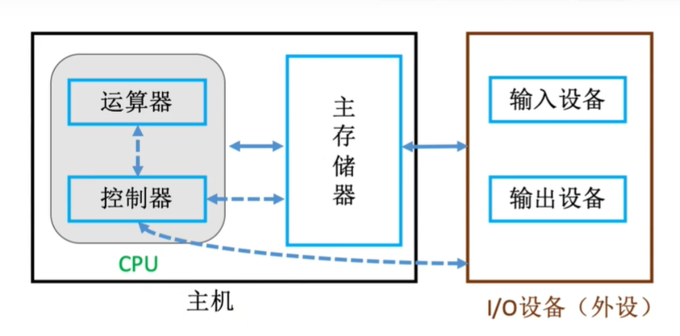

# 基础知识

## 冯诺依曼体系结构

1. 计算机硬件由运算器、控制器、存储器、输入设备和输出设备五大部分组成
2. 计算机处理的数据和指令一律用二进制数表示
3. 顺序执行程序

## 现代计算机架构

1. 以存储器为核心,首先把数据放入存储器,之后控制器控制运算器处理数据,最后发送给输出设备
2. 主机并不是指电脑那个主机,而是特指主存储器+运算器+控制器




**另外要注意主机只包括主存储器,也就是内存,机械硬盘什么的都属于辅存储器,应该归属于I/O设备.**

## 指令

包括操作码和地址码两部分

## 性能指标

### CPU性能指标

1. 时钟周期:时钟周期是计算机中最基本的、最小的时间单位,也就是cpu内部所产生一个bit信号所需时间
2. 主频(时钟频率):指cpu工作频率就是1s内所完成的时钟周期,即时钟周期的倒数.
3. CPI(Clock cycle Per Instruction):执行一条指令所需的时钟周期数
4. IPS ( Instructions Per Second ） :每秒执行多少条指令
5. FLOPS(Floating-point Operations Per Second）:每秒执行多少次浮点运算

### 系统性能指标

1. 数据通路带宽:数据总线一次所能并行传送信息的位数（各硬件部件通过数据总线传输数据)
2. 吞吐量:指系统在单位时间内处理请求的数量。它取决于信息能多快地输入内存，CPU能多快地取指令，数据能多快地从内存取出或存入，以及所得结果能多快地从内存送给一台外部设备。这些步骤中的每一步都关系到主存，因此，系统吞吐量主要取决于主存的存取周期。
3. 响应时间:指从用户向计算机发送一个请求，到系统对该请求做出响应并获得它所需要的结果的等待时间。通常包括CPU时间（运行一个程序所花费的时间）与等待时间（用于磁盘访问、存储器访问、/o操作、操作系统开销等时间）。
   
   
   
   

# 冯诺依曼体系结构简介

## 主存储器

### 存储的基本原理

如果想要读取主存储器的数据,

1. 首先主存会去MAR找到你所需数据的地址,
2. 然后根据地址去存储体中取出数据,
3. 放入MDR中
4. 你最终是从MDR里面读取数据


- MAR:Memory Address Register (储存地址寄存器)

- MDR:Memory Data Register (储存数据寄存器)

此时我们就可以发现,MAR决定了寻址的范围,比如说MAR有8 bit,那么就最多可以访问$2^8$这么多地址,而MDR则决定了一次可以存储数据的最大值.

### 存储体结构

- 存储单元:每个存储单元存放一串二进制代码
- 存储字(word):存储单元中二进制代码的组合,就比如说100 0001这个二进制代码,既可以表示65这个数字,也可以表示ASCII的A,也就是说这个二进制组合根据不同理解有着不同含义.
- 存储字长:存储单元中二进制代码的位数
- 存储元:即存储二进制的电子元件，每个存储元可存1bit


## 运算器

运算器是用来进行运算的组件,包括算术运算和逻辑运算.


- ACC:累加器，用于存放操作数，或运算结果。
- MQ:乘商寄存器，在乘、除运算时，用于存放操作数或运算结果。
- X:通用的操作数寄存器，用于存放操作数
- ALU:算术逻辑单元，通过内部复杂的电路实现算数运算、逻辑运算
  

## 控制器

控制器工作的流程如下:

1. PC 来取指令
2. IR 分析指令内容
3. CU 执行具体的指令


- CU(Control Unit):控制单元，分析指令，给出控制信号
- IR(Instruction Register):指令寄存器，存放当前执行的指令
- PC(Program Counter):程序计数器，存放下一条指令地址，有自动加1功能

## 主机工作的完整流程

以高级语言的一次计算为例来了解计算机详细运行原理

```c
int a=2,b=3,c=1,y=0;
void main()
{
  y=a*b+c;
}
```


### 第一条指令-取数


0. 初始状态,PC=0,指向MAR
1. PC通过地址总线访问MAR,并且把存储的地址赋值给MAR,此时MAR=0,PC自增1,此时PC=1
2. MAR发现要访问的地址为0,就去存储体中访问0号地址
3. MAR找到0号地址之后,就把这个指令的内容传给MDR,此时MDR的值就是(<span style="color:red">000001</span> <span style="color:brown">0000000101</span>)
4. 把MDR的数据放入IR分析
5. IR把前六位的操作码送给CU去处理
6. CU发现这个指令是取数指令,所以指挥IR把该指令的地址码发给MAR以便取数.
7. 此时MAR的二进制值为101也就是5,所以去存储体访问5号地址
8. 拿到5号地址的内容(也就是2)以后,再发给MDR暂存,此时MDR=2
9. MDR把内容发给ACC,此时ACC=2

### 第二条指令-乘法


 

1. IR访问MAR,把自身的值(1),赋给MAR,此时MAR=1,IR自增,此时为2
2. MAR去存储体访问1号地址
3. 把1号地址的内容存到MDR里面去
4. 继续把MDR的内容交给IR来分析
5. IR还是把操作码给CU,CU发现是取数再乘法的指令,
6. CU随后指挥IR把地址码发给MAR
7. MAR去访问二进制为110的地址(十进制6)
8. 把6号地址的数据存入MDR
9. MDR把数据放入MQ,也就是乘商寄存器
10. ACC把被乘数放入通用寄存器X
11. CU指挥ALU完成乘法操作,并把结果放在ACC里面

### 第三条指令-加法


1. IR访问MAR,把自身的值(2),赋给MAR,此时MAR=2,IR自增,此时为3
2. MAR去存储体访问2号地址
3. 把2号地址的内容存到MDR里面去,也就是加法指令
4. MDR把内容交给IR来分析
5. IR把操作码给CU,CU发现是取数再加法的指令,
6. CU随后指挥IR把地址码发给MAR
7. MAR去访问二进制为111的地址(十进制7)
8. 把7号地址的数据存入MDR
9. MDR把数据放入通用寄存器x
10. CU指挥ALU完成加法操作,并把结果放在ACC里面,因为ACC是累加的,所以此时的值为a*b+c


### 第四条指令-存储


1. 老规矩了,PC给MAR赋值,之后自增为4
2. MAR访问存储体
3. 把数据传给MDR
4. IR分析数据
5. CU拿到操作码,发现是给存储体写入数据,而且地址码为8号,
6. CU指挥IR去把地址码赋给MAR,找到需要存储数据的地址是哪个
7. 然后CU又去指挥ACC把数据存到MDR里面,以备数据写入
8. MAR在存储体找到了所需要储存的位置
9. MDR根据MAR的信息,把数据存入内存之中.此时8号地址也就是y,此时y=a*b+c;

### 第五条指令-终止


1. PC赋值MAR之后自增
2. MAR访问4号地址的内容
3. 把数据存到MDR
4. IR分析数据
5. CU发现是停机指令,之后系统中断.

# 数据编码

计算机只能存二进制数据,但是我们平时用的都是十进制还有字符串什么的,那应该怎么样才能存储这些数据呢?

我们一般都采用编码,人为地把这些数据转化为二进制数据,以便让计算机存储.

## 数字

### BCD码(Binary-Coded Decimal‎)

BCD码用4位二进制数来表示一位十进制数,可以建立一个一一映射.

#### 8421码

所谓8421,就是因为规定二进制数1111的每位的权值分别为8421

8421码的映射关系如下

|     0     |     1     |     2     |     3     |  4   |  5   |  6   |  7   |  8   |  9   |
| :-------: | :-------: | :-------: | :-------: | :--: | :--: | :--: | :--: | :--: | :--: |
|   0000    |   0001    |   0010    |   0011    | 0100 | 0101 | 0110 | 0111 | 1000 | 1001 |
|    10     |    11     |    12     |    13     |      |      |      |      |      |      |
| 0001 0000 | 0001 0001 | 0001 0010 | 0001 0011 |      |      |      |      |      |      |

这个东西光靠讲讲不清的,但是举一个例子就很简单了

5+8=13,这个是十进制的表示,接下来我用8421码来表示

0101+1000=1101,此时发现13不在映射表内,我们知道13应该表示为(0001 0011),为了使这个10能进位,我们可以手动加一个6,因为4位二进制最大值就是15,原理就是原数+6后取16的模作为低位,高位进位,且保留高位.

所以可以确保加了之后高位进位.之后1101+0110=0001 0011,这样就可以用8421码表示十进制了.

#### 余3码

就是在8421码的基础上再加3.

|  0   |  1   |  2   |  3   |  4   |  5   |  6   |  7   |  8   |  9   |
| :--: | :--: | :--: | :--: | :--: | :--: | :--: | :--: | :--: | :--: |
| 0011 | 0100 | 0101 | 0110 | 0111 | 1000 | 1001 | 1010 | 1011 | 1100 |

#### 2421码

人为规定二进制1111的权值分别为2421,因为有两个2,所以为了防止编码,规定0~4开头必须是0,后面开头必须是1

|  0   |  1   |  2   |  3   |  4   |  5   |  6   |  7   |  8   |  9   |
| :--: | :--: | :--: | :--: | :--: | :--: | :--: | :--: | :--: | :--: |
| 0000 | 0001 | 0010 | 0011 | 0100 | 1011 | 1100 | 1101 | 1110 | 1111 |

## 字符和字符串

### ASCII码

使用7位二进制数来表示常用的字符,最高位为0,这个最高位是用来进行奇偶校验的.

# 数据校验

## 奇偶校验码

### 原理

这个校验码非常简单,是根据你bit流中'1'的奇偶数量决定的,分为奇校验和偶校验两种.我们先看奇校验.

假如你原来的数据是 11011010,原数据1的数量为奇数,那么我就在bit流的前面(或者后面)添加一个0,确保1的数量为奇数.如果接受到数据的时候1还是奇数,那么就可以断定数据正常送到(其实不一定).

偶校验和上面的一样,原来的数据是 11011010,为了保证1的数量为偶数,就在后面(或前面)添加一个1.数据到达之后再判断1是否为偶数.

这其实并不能很好校验数据差错,比如说采用奇校验,发送的数据为  011011010 ,现在路上发生了差错,数据到达后变成了000011010,但是1的数量还是奇数,这就产生了问题.但是如果只变化了一位 111011010 现在就能看出来了.

也就是说,**奇偶校验码只能检验出奇数数量的变化**

### 偶校验的异或实现

奇偶校验码的校验位可以通过异或运算得到.

比如说对 111 1001进行偶校验,首先

1. 对其每一项进行异或运算:1⊕1⊕1⊕1⊕0⊕0⊕1=1

2. 之后用原数据加上这个校验位1111 1001

如果想进行校验,只需要异或每一项,如果为0,说明1的个数为偶数,也就是没问题(其实不一定).1⊕1⊕1⊕1⊕1⊕0⊕0⊕1=0.如果不为0,说明出错了.

## 海明校验码

海明码是基于偶校验码的加强版,它把数据划分成多个区域,分别进行偶校验,从而实现纠错.海明码不仅仅能够检查出错误,还能够检查出到底哪一位出了错.

**注意海明码只能检查1位的错误.**

### 1.确定校验码的位数

海明码就是超级加强版奇偶校验码,奇偶校验码只有一个校验位,也就是说只能反映两种信息"对",或者"错".为了提高更多的信息,就需要适当增加校验的位数,但是到底加多少才合适呢?

假设原来的数据有k位,校验位有r位,那么这r位校验码最多可以表示$2^r$这么多种状态,而这些状态包括了,"正确状态,第0位出错,第1位出错,第二位出错等信息",而这些位数总共有k+r+1这么多位(包括校验码出错,还有原数据出错,还有正确状态),所以说,这$2^r$种状态至少大于k+r+1,才可以表示每一位出错外加正确情况.

所以我们可以列出不等式:	$$2^r ≥ k+r+1$$

比如说我们需要发送数据$D=101101$ ,

则:$k=6$ ,$$2^r ≥ 6+r+1$$

所以:$r≥4$

所以D的海明码应该有6+4=10位.数据位6位,校验位4位.

### 2.确定校验码和数据的位置

说到校验位的位置,我们很自然就想把它塞到数据位的前面,但是海明码可不是那种随便的码.如果你全部一股脑放到了最前面,那么到底该如何分组进行校验呢?所以海明码规定把校验码$P_i$放到第$2^{i-1}$的位置.剩下的位置由数据位依次填充.如下图所示:

| 数据位 | 10   | 9   | 8   | 7   | 6   | 5   | 4   | 3   | 2   | 1   |
| ------ | ----- | ---- | ---- | ---- | ---- | ---- | ---- | ---- | ---- | ---- |
| 数据位的二进制 | 1010 | 1001 | 1000 | 0111 | 0110 | 0101 | 0100 | 0011 | 0010 | 0001 |
| 数据   |$D_6$|$D_5$|$P_4$|$D_4$|$D_3$|$D_2$|$P_3$ |$D_1$|$P_2$|$P_1$ |
| 值 |1|0||1|1|0| |1|| |

### 3.求出校验码

由上表可知,$P_1$数据位的第一位是1,同样第一位为1的还有$D_1$,$D_2$,$D_4$,$D_5$,所以:

$$ P_1 =  D_1 \oplus D_2 \oplus D_4 \oplus D_5 = 0$$ 

$P_2 $右边第二位为1,同理,右边第二位为1的还有$D_1$,$D_3$,$D_4$,$D_6$,所以:

$$ P_2 =  D_1 \oplus D_3 \oplus D_4 \oplus D_6 = 0$$ 

同理得出 $P_3=0$,$P_4=1$.

所以101101的海明码应该为 ==00==1==0==011==1==01.

注意,这一步进行异或的数据位,就是所求校验码的管辖数据.比如$P_1$管理$D_1,D_2,D_3,D_4$.

### 4.检错与纠错

假设第5位(也就是$D_2$)出错,因此,接收到的数据位为0010001101.

| 数据位         | 10    | 9     | 8     | 7     | 6     | 5     | 4     | 3     | 2     | 1     |
| -------------- | ----- | ----- | ----- | ----- | ----- | ----- | ----- | ----- | ----- | ----- |
| 数据位的二进制 | 1010  | 1001  | 1000  | 0111  | 0110  | 0101  | 0100  | 0011  | 0010  | 0001  |
| 数据           | $D_6$ | $D_5$ | $P_4$ | $D_4$ | $D_3$ | $D_2$ | $P_3$ | $D_1$ | $P_2$ | $P_1$ |
| 值             | 1     | 0     | 1     | 1     | 1     | 0     | 0     | 1     | 0     | 0     |

接着令所有校验码和管辖范围内的数据进行异或运算.

1. $$S_1 = P_1 \oplus D_1 \oplus D_2 \oplus D_4 \oplus D_5 = 1$$ 

2. $$S_2 = P_2 \oplus D_1 \oplus D_3 \oplus D_4 \oplus D_6 = 0$$ 

3. $$S_3 = P_3 \oplus D_2 \oplus D_3 \oplus D_4 = 1$$ 

4. $$S_4 = P_4 \oplus  D_5 \oplus D_6 = 0$$ 

然后从高到低排列: $S_4S_3S_2S_1=(0101)_2=5$,也就是第五位错了.

这个的原理很复杂,但是我们可以简单看看皮毛.看上面的式子,一旦$D_2$出错,那么对应的式子中,只要有$D_2$那么整体就会为1.也就是说只要让每个位出错时,剩下的式子刚好能表示其位置就好了.

比如说$D_4$出现在前三个式子,那么一旦$D_4$出错,刚好就是$(0111)_2$,十进制就是7.具体构造这里不说了,了解大概原理即可.

*顺便一提,如果没错的话,那么算下来都是0.*

### 5.完整版海明码

但是现在这个版本的海明码还是有问题啊,假如说$P_1$和$P_2$同时变化,那么答案算下来就是3(用我刚才讲的,直接把含有$P_1$和$P_2$的式子变为1).

但是第三位并没有错,错的是世界(误),错的是$P_1$和$P_2$.那么就反映了一个问题,海明码可以找出一个bit的错误,但是不能找出多个bit的错误,那么怎末区分发过来的海明码到底是错了几个位呢?

为了解决这个问题,人们手动在最后头加一个全体校验码,以便检查到底错了几个bit.

这个$P_全$就是对整体进行一个偶校验,本例中,$P_全=1$

| 数据位 | 11   | 10    | 9     | 8     | 7     | 6     | 5     | 4     | 3     | 2     | 1     |
| ------ | ---- | ----- | ----- | ----- | ----- | ----- | ----- | ----- | ----- | ----- | ----- |
| 数据   | $P_全$ | $D_6$ | $D_5$ | $P_4$ | $D_4$ | $D_3$ | $D_2$ | $P_3$ | $D_1$ | $P_2$ | $P_1$ |
| 值     | 1 | 1     | 0     | 1     | 1     | 1     | 0     | 0     | 1     | 0     | 0     |

那么现在就有这么几种情况:

1. $S_4S_3S_2S_1=0$且全体偶校验成功.说明数据正常.
2. $S_4S_3S_2S_1!=0$且全体偶校验失败,说明有一位出错,改正即可.
3. $S_4S_3S_2S_1!=0$且全体偶校验成功.说明数据两位出错,需要重传.

那三个怎么办呢?我也不知道,有机会补坑吧.

## 循环冗余校验码

### 选择一个生成多项式

循环冗余码的原理倒没那么复杂,说白了就是把原数据加上校验码之后,除以一个数并保证余数为0.之后发给对面,如果他们收到的这个数据除以同样的数也没有余数,说明这个数据没问题.


接下来就是令人头疼的地方了,到底选哪个数作为除数呢?我这边选一个996,你那边选一个0721,两边谁都不能说服谁,怎么办呢?

这时候人们就想出来一个点子,任意一个由二进制位串组成的代码都可以和一个系数仅为‘0’和‘1’取值的多项式一一对应。例如：代码1010111对应的多项式为$x^6+x^4+x^2+x+1$，而多项式为$x^5+x^3+x^2+x+1$对应的代码101111。这时候只需要定一个标准的多项式,就可以确定一个标准的除数了.

常用的循环冗余校验标准多项式如下：

CRC(12位) =$X^{12}+X^{11}+X^3+X^2+X+1$

CRC(16位) = $X^{16}+X^{15}+X^2+1$

CRC(CCITT) = $X^{16}+X^{12} +X^5+1$

CRC(32位) = $X^{32}+X^{26}+X^{23}+X^{22}+X^{16}+X^{12}+X^{11}+X^{10}+ X^8+X^7+X^5+X^4+X^2+X+1$

以CRC(16位)多项式为例，其对应校验二进制位列为1100 0000 0000 0101。

**我们把这个多项式叫生成多项式**

### 计算校验码

现在有了除数了,但是我们必须确保原数据加校验码之后,一除余数为0.这时候靠猜肯定是不行了,我们需要来手动计算校验码.

首先确定校验码的位数,这个其实很简单,生成多项式最高次幂是多少,就有多少位,比如生成多项式为10011,那么就有4位校验码.之后,你校验码有几位,就在原数据后面补几个0,最后除以生成多项式,你校验码有几位,就余几位作为你的校验码.

假设我们需要发送的数据为11 0101 1011,生成多项式为10011.之后用(数据+校验码与多项式进行**模2除法**,也就是说,进行运算时一律进行异或运算,并不像往常的除法那样相减.

因为生成多项式最高次幂为4,所以在原数据后面补4个0,即 11 0101 1011 0000 之后模2除以10011 余数为1110,这个余数就是校验码.

### 检查与纠错

这个没啥说的,对方收到你的数据之后,用同样的生成多项式进行模2除法,如果结果不为0,说明出错,为0说明正确.

其实循环冗余码也可以进行单bit纠错,除完之后余数是几,就说明第几位出错,非常方便.

但是要注意,设你校验码的位数为r,数据位为k,那么若$$2^r ≥ k+r+1$$,才能进行纠错.原理之前解释过了,r位的校验码最多表示$2^r$种状态,正确,第一位错,第二位错,,,,,,等等,一共有k+r+1种情况,只有你的校验码足以表示这么多情况时,才能使用纠错的功能.

实际中,生成多项式都比较短,而数据都特别大,所以一般只用于检查错误,不用于纠错.

# 数据储存

## 定点数的储存


