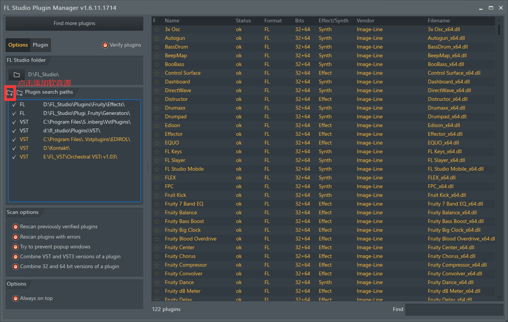
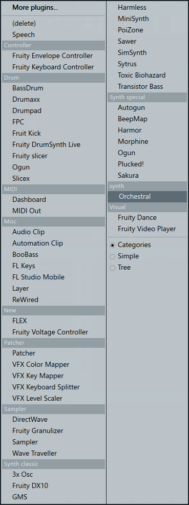
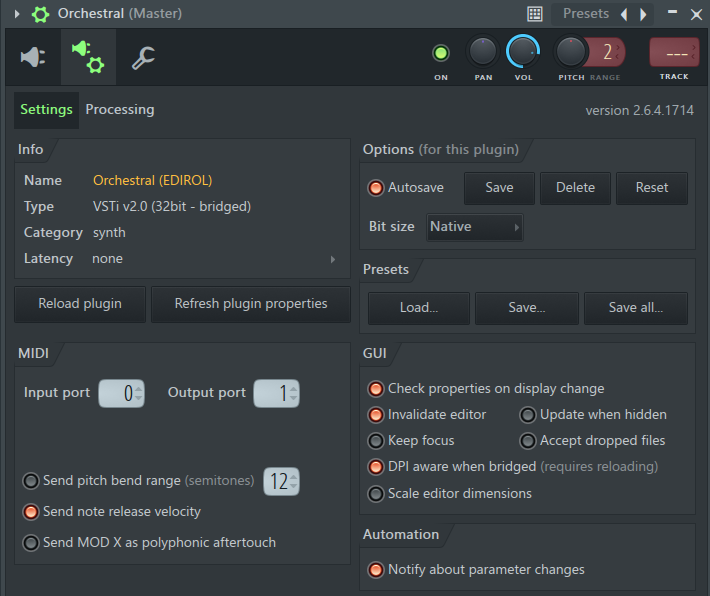
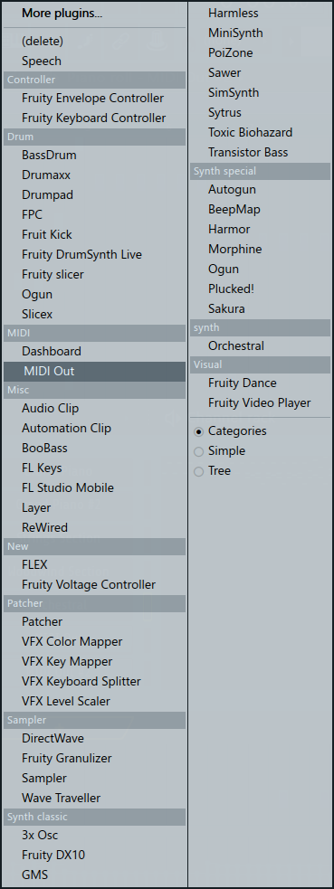
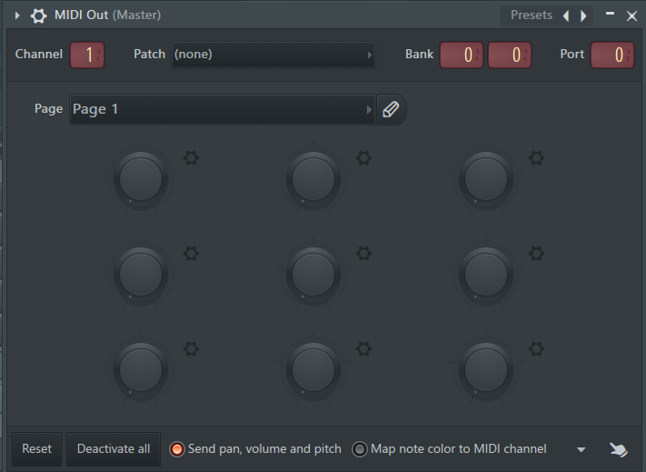
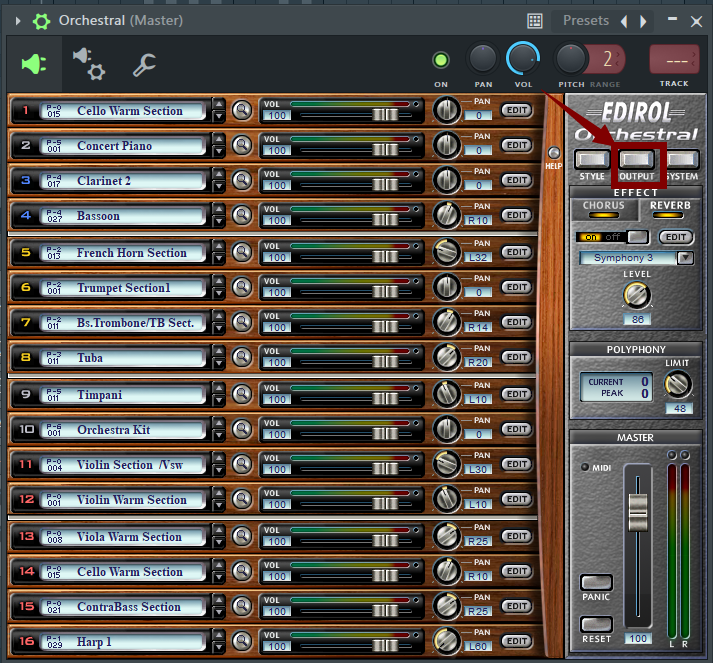
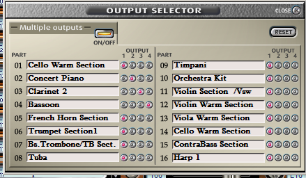
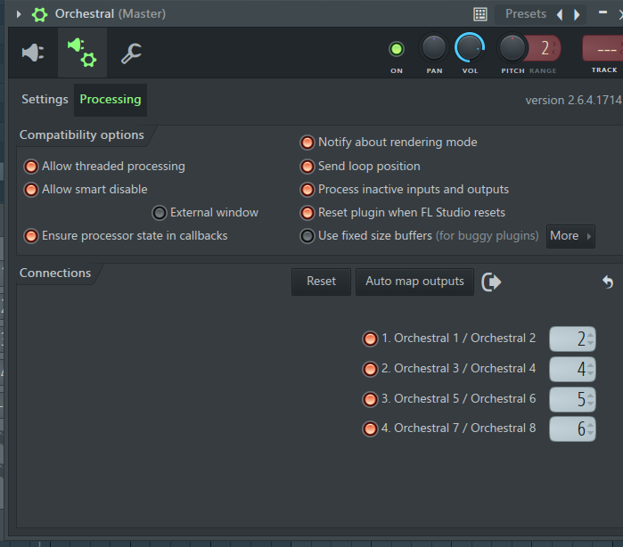

# 基础

## 设置声卡驱动

左上角菜单options—audio settings，最上面有一个Device的下拉框，选择主声音驱动。如果这个卡的话，就选择下面的FL Studio ASIO。

## 软音源导入

1. 首先下载软音源，放到某个容易找到的文件夹里面。

2. 打卡FL，左上角options—manage plugins

3. 在Plugin search paths左边点击添加插件。

   

4. 选择你刚才安装的路径即可。

5. 点击上面那个Find more plugins，来刷新插件库。

6. 完成。

## 打开文件夹

如何把文件夹添加到FL的左侧呢？

1. 打卡FL，左上角options—file settings
2. 把路径复制到中间就可以了

## 使用midi键盘

1. 先把midi插进来
2. 点击左上角options—midi settings
3. 中间有一个input框框，里面找到你的midi，然后点下面的Enable。
4. 好了

# 改变节拍

## 改变整体节拍

1. 按F10
2. 点project
3. numerator就是几拍，denominator就是以几分音符为一拍

# 快捷键

| 快捷键        | 中文     |      |
| ------------- | -------- | ---- |
| shift ctrl s  | 另存为   |      |
| 选中后 ctrl b | 向后复制 |      |
|               |          |      |

# 罗兰交响乐

## midi out导出音色

1. 在通道机架上面点击+号，找到Orchestral

   

   2. 在Orchestral中配置input和output

      

   3. 再次在通道机架上面添加若干midi out

      

   4. 配置midi out的输出通道，在左上角。上面是几，就导出罗兰管弦乐的几号通道。

      

   

## 将音轨导出到调音台

1. 打开罗兰管弦乐的配置，找到output

   

2. 把你想要导出的音色分别导出到1，2，3，4通道上面

   

3. 然后来到这里，注意点Processing，不是settings。然后把刚才1，2，3，4的通道分别导出到FL上面的通道，最多只能导出4个。

   

# 专业英语

## 乐器

- 弦乐

| 弦乐       | string   | 铜 管       | brass        | 木管         | woodwind           | 打击乐  | percussion |
| ---------- | -------- | ----------- | ------------ | ------------ | ------------------ | ------- | ---------- |
| violin     | 小提琴   | trumpet     | 小号         | piccolo      | 短笛               | timpani | 定音鼓     |
| viola      | 中提琴   | trombone    | 长号         | flute        | 长笛               |         |            |
| cello      | 大提琴   | tuba        | 大号         | clarinet     | 单簧管、黑管       |         |            |
| contrabass | 低音提琴 | French horn | 法国号、圆号 | oboe         | 双簧管             |         |            |
| harp       | 竖琴     | flugelhorn  | 军号         | English horn | 英国管、中音双簧管 |         |            |
|            |          | euphonium   | 尤风宁号     | bassoon      | 巴松管、大管       |         |            |
|            |          |             |              | saxophone    | 萨克斯管           |         |            |
|            |          |             |              |              |                    |         |            |

- 铜管

|      |      |
| ---- | ---- |
|      |      |
|      |      |
|      |      |
|      |      |

## 演奏技巧

| 单词     | 翻译       | 单词       | 翻译   |
| -------- | ---------- | ---------- | ------ |
| spiccato | 跳弓       | orchestral | 管弦乐 |
| tremolo  | 颤音、震音 | choric     | 合唱   |
|          |            |            |        |
|          |            |            |        |

